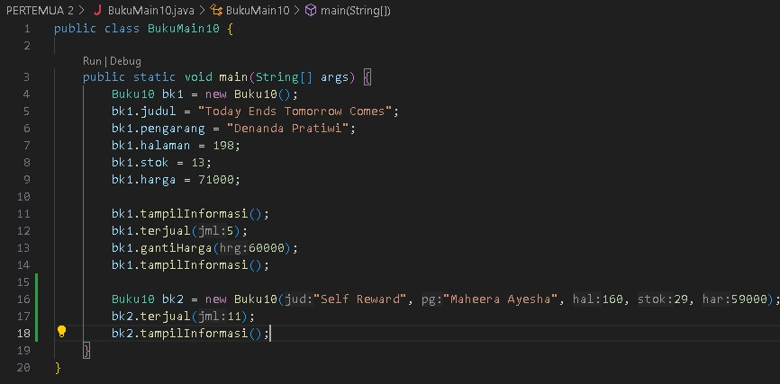
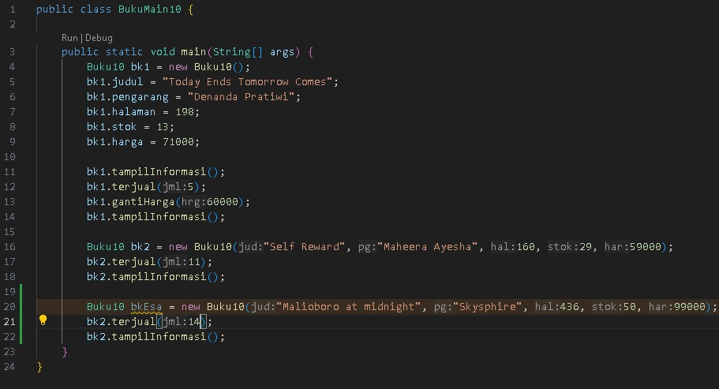

# 
  LAPORAN PRAKTIKUM ALGORITMA DAN STRUKTUR DATA 
 
    

    

     

 Nama       : ESA PRATAMA PUTRI 

 NIM        : 2341720061 

 Kelas / no : TI-1B / 10 

 Jurusan    : TEKNOLOGI INFORMASI 

## 2.1 Percobaan 1: Deklarasi Class, Atribut dan Method

## 2.3 PERTANYAAN
1. Sebutkan dua karakteristik class atau object! 
      - Encapsulation (Enkapsulasi): Ini adalah konsep yang menggabungkan data dan fungsi yang bekerja pada data ke dalam unit tunggal yang disebut objek. Dalam enkapsulasi, data di dalam objek tidak dapat diakses secara langsung dari luar objek. Sebaliknya, mereka hanya dapat diakses melalui metode yang didefinisikan di dalam kelas. Ini membantu dalam pengendalian akses data dan mencegah perubahan yang tidak sah.

      - Inheritance (Pewarisan): Ini adalah mekanisme di mana sebuah kelas dapat mewarisi sifat dan perilaku dari kelas lain yang disebut kelas induk atau superclass. Kelas yang mewarisi sifat disebut kelas turunan atau subkelas. Pewarisan memungkinkan kita untuk menggunakan kembali kode yang sudah ada, menghindari duplikasi kode, dan membangun hirarki kelas yang terstruktur. Dengan pewarisan, kita dapat menambahkan fitur-fitur tambahan ke kelas turunan tanpa mengubah kelas induk.

2. Perhatikan class Buku pada Praktikum 1 tersebut, ada berapa atribut yang dimiliki oleh class
Buku? Sebutkan apa saja atributnya! 
      Class buku memiliki 5 atribut yaitu judul, pengarang, stock, harga

3. Ada berapa method yang dimiliki oleh class tersebut? Sebutkan apa saja methodnya! 
      Ada 4 method
      - method tampil informasi
      - method terjual
      - method restock
      - method ganti harga

4. Perhatikan method terjual() yang terdapat di dalam class Buku. Modifikasi isi method tersebut
sehingga proses pengurangan hanya dapat dilakukan jika stok masih ada (lebih besar dari 0)! 
      void terjual(int jml) {
        if (stok > 0 && jml <= stok)
            stok -= jml;
    }

5. Menurut Anda, mengapa method restock() mempunyai satu parameter berupa bilangan int? 
   pemilihan parameter bilangan bulat untuk method restock() dapat memberikan kemudahan penggunaan, validasi input

6. Commit dan push kode program ke Github

## 2.2 Percobaan 2: Instansiasi Object, serta Mengakses Atribut dan Method

## 2.2.3 PERTANYAAN
1. Pada class BukuMain, tunjukkan baris kode program yang digunakan untuk proses instansiasi! 
Apa nama object yang dihasilkan?
      Buku10 bk1 = new Buku10();

2. Bagaimana cara mengakses atribut dan method dari suatu objek? 
      this.nim = nim;

3. Mengapa hasil output pemanggilan method tampilInformasi() pertama dan kedua berbeda? 
      tergantung pada implementasi method tersebut dan juga keadaan objek pada saat pemanggilan

## 2.3 Percobaan 3: Membuat Konstruktor
1. class Buku  

2. class BukuMain  

## 2.3.3 Pertanyaan
1. Pada class Buku di Percobaan 3, tunjukkan baris kode program yang digunakan untuk
mendeklarasikan konstruktor berparameter! 
      ada 5 konstruktor berparameter, judul, pengarang, halaman, stok, harga

2. Perhatikan class BukuMain. Apa sebenarnya yang dilakukan pada baris program berikut? 
      objek bk2 dari class Buku10 dengan menggunakan konstruktor berparameter untuk menginisialisasi nilai atribut-atribut objek tersebut

3. Hapus konstruktor default pada class Buku, kemudian compile dan run program. Bagaimana
hasilnya? Jelaskan mengapa hasilnya demikian! 
      maka akan terjadi kesalahan kompilasi. Hal ini karena dalam program tersebut, ketika objek dibuat tanpa menggunakan konstruktor default, konstruktor default tersebut secara implisit dipanggil saat pembuatan objek baru jika tidak ada konstruktor lain yang ditentukan dalam class

4. Setelah melakukan instansiasi object, apakah method di dalam class Buku harus diakses
secara berurutan? Jelaskan alasannya! 
      Tidak, method di dalam class Buku10 tidak harus diakses secara berurutan setelah melakukan instansiasi objek

5. Buat object baru dengan nama buku<NamaMahasiswa> menggunakan konstruktor
berparameter dari class Buku! 
      
