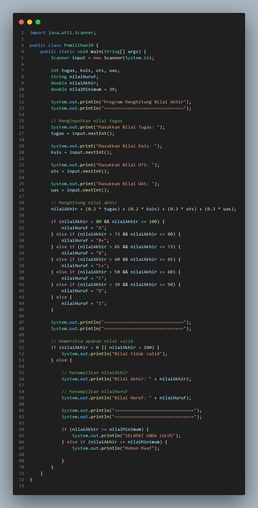
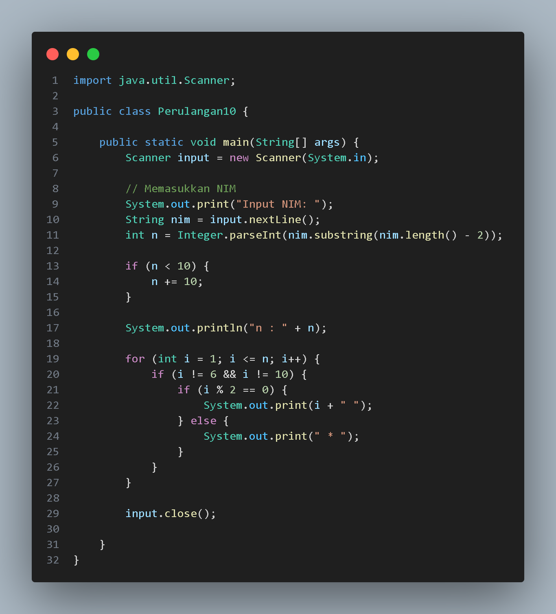
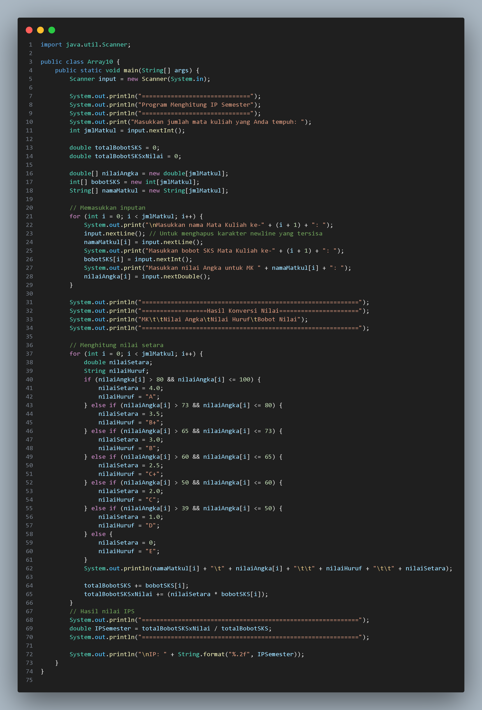
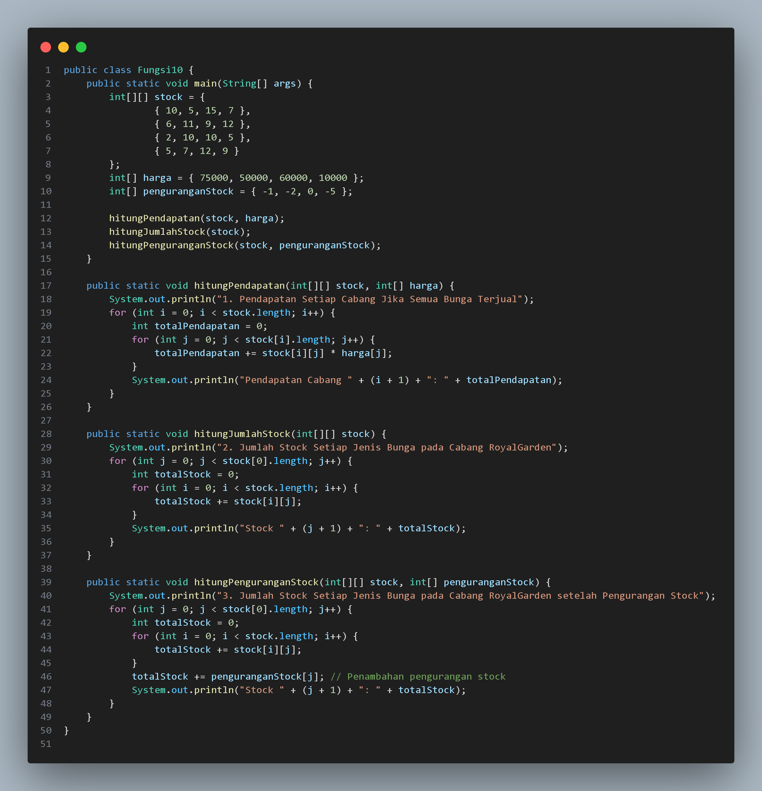
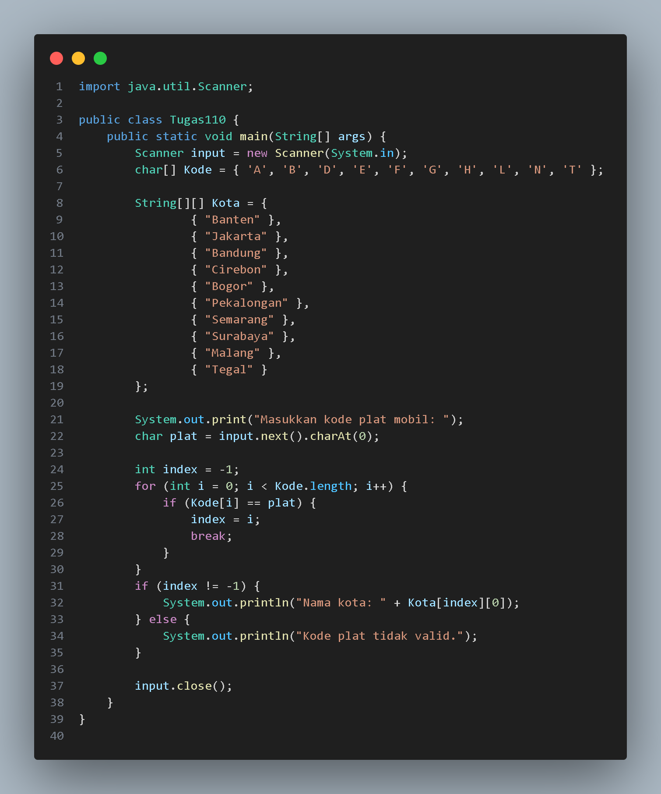
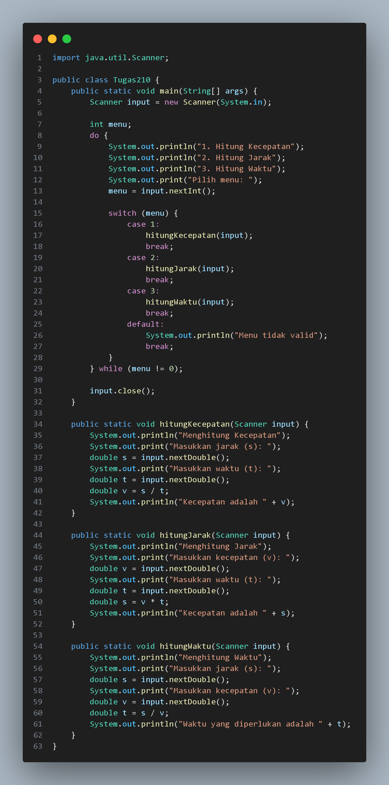

# 
  LAPORAN PRAKTIKUM ALGORITMA DAN STRUKTUR DATA 

# 
 JOBSHEET 1 KONSEP DASAR PEMROGRAMAN 

    

    

     

 Nama       : ESA PRATAMA PUTRI 

 NIM        : 2341720061 

 Kelas / no : TI-1B / 10 

 Jurusan    : TEKNOLOGI INFORMASI 

## 2.2.1 Praktikum Pemilihan
- input  

- output  

## 2.3.1 Praktikum Perulangan
- input  
  
- output  

## 2.4.1 Praktikum Array
- input  

- output  

## 2.5.1 Praktikum Fungsi
- input  
  
- output  

## TUGAS
1. SOAL 1
- input  
  
- output  

2. SOAL 2
- input  
  
- output  
