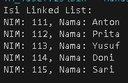
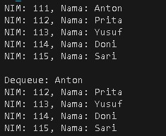

# <p align ="center">  LAPORAN PRAKTIKUM ALGORITMA DAN STRUKTUR DATA </p>
# <p align ="center">  PRAKTIKUM 11 </p>
<br><br><br><br>

<p align="center">
    </p>

<br><br><br><br><br>

<p align = "center"> Nama       : ESA PRATAMA PUTRI </p>
<p align = "center"> NIM        : 2341720061 </p>
<p align = "center"> Kelas / no : TI-1B / 10 </p>
<p align = "center"> Jurusan    : TEKNOLOGI INFORMASI </p>

## 2.1 Pembuatan Single Linked List
 <br>
 <br>
 <br>
## 2.1.1 Verifikasi Hasil Percobaan
 <br>
## 2.1.2 Pertanyaan
1. Mengapa hasil compile kode program di baris pertama menghasilkan “Linked List Kosong”? <br>
kode tersebut menghasilkan "Linked List Kosong" karena kondisi di metode print() adalah if (isEmpty()), yang mengembalikan true jika head bernilai null <br>
2. Jelaskan kegunaan variable temp secara umum pada setiap method! <br>
Variabel temp digunakan sebagai pointer untuk menelusuri linked list, variabel temp biasanya dimulai dari head dan kemudian dipindahkan ke node berikutnya hingga mencapai node yang diinginkan
3. Perhatikan class SingleLinkedList, pada method insertAt Jelaskan kegunaan kode berikut <br>
if (temp.next == null) tail = temp.next; <br>
Kode tersebut digunakan untuk menyisipkan node baru ke dalam linked list pada posisi tertentu (ditentukan oleh index). kode ini mengganti referensi temp.next dengan node baru (new Node10(input, temp.next)) <br>

## 2.2 Modifikasi Elemen pada Single Linked List
 <br>
```
public class SingleLinkedList10 {

    Node10 head, tail;

    boolean isEmpty() {
        return head == null;
    }

    void print() {
        if (isEmpty()) {
            System.out.println("Linked List kosong");
        } else {
            Node10 tmp = head;
            System.out.print("Isi Linked List \t");
            while (tmp != null) {
                System.out.print(tmp.data + "\t");
                tmp = tmp.next;
            }
            System.out.println("");
        }
    }

    void addFirst(int input) {
        Node10 ndInput = new Node10(input, null);
        if (isEmpty()) {
            head = ndInput;
            tail = ndInput;
        } else {
            ndInput.next = head;
            head = ndInput;
        }
    }

    void addLast(int input) {
        Node10 ndInput = new Node10(input, null);
        if (isEmpty()) {
            head = ndInput;
            tail = ndInput;
        } else {
            tail.next = ndInput;
            tail = ndInput;
        }
    }

    void insertAfter(int key, int input) {
        Node10 ndInput = new Node10(input, null);
        Node10 temp = head;
        while (temp != null) {
            if (temp.data == key) {
                ndInput.next = temp.next;
                temp.next = ndInput;
                if (ndInput.next == null) {
                    tail = ndInput;
                }
                break;
            }
            temp = temp.next;
        }
    }

    void insertAt(int index, int input) {
        Node10 ndInput = new Node10(input, null);
        if (index < 0) {
            System.out.println("Perbaiki logikanya! Kalau indeksnya -1 bagaimana??");
        } else if (index == 0) {
            addFirst(input);
        } else {
            Node10 temp = head;
            for (int i = 0; i < index - 1 && temp != null; i++) {
                temp = temp.next;
            }
            if (temp != null) {
                ndInput.next = temp.next;
                temp.next = ndInput;
                if (ndInput.next == null) {
                    tail = ndInput;
                }
            } else {
                System.out.println("Indeks melebihi panjang linked list");
            }
        }
    }

    int getData(int index) {
        Node10 tmp = head;
        for (int i = 0; i < index && tmp != null; i++) {
            tmp = tmp.next;
        }
        if (tmp != null) {
            return tmp.data;
        }
        return -1;
    }

    int indexOf(int key) {
        Node10 tmp = head;
        int index = 0;
        while (tmp != null && tmp.data != key) {
            tmp = tmp.next;
            index++;
        }
        if (tmp == null) {
            return -1;
        }
        return index;
    }

    void removeFirst() {
        if (!isEmpty()) {
            head = head.next;
            if (head == null) {
                tail = null;
            }
        } else {
            System.out.println("Linked list masih kosong,");
        }
    }

    void removeLast() {
        if (!isEmpty()) {
            if (head == tail) {
                head = tail = null;
            } else {
                Node10 temp = head;
                while (temp.next != tail) {
                    temp = temp.next;
                }
                temp.next = null;
                tail = temp;
            }
        } else {
            System.out.println("Linked list masih kosong, tidak dapat dihapus");
        }
    }

    void remove(int key) {
        if (!isEmpty()) {
            Node10 temp = head;
            if (temp.data == key) {
                removeFirst();
                return;
            }
            while (temp.next != null) {
                if (temp.next.data == key) {
                    temp.next = temp.next.next;
                    if (temp.next == null) {
                        tail = temp;
                    }
                    return;
                }
                temp = temp.next;
            }
            System.out.println("Elemen tidak ditemukan dalam linked list");
        } else {
            System.out.println("Linked list masih kosong, tidak dapat dihapus");
        }
    }

    public void removeAt(int index) {
        if (!isEmpty()) {
            if (index == 0) {
                removeFirst();
            } else {
                Node10 temp = head;
                for (int i = 0; temp != null && i < index - 1; i++) {
                    temp = temp.next;
                }
                if (temp == null || temp.next == null) {
                    System.out.println("Indeks melebihi panjang linked list");
                } else {
                    temp.next = temp.next.next;
                    if (temp.next == null) {
                        tail = temp;
                    }
                }
            }
        } else {
            System.out.println("Linked list masih kosong, tidak dapat dihapus");
        }
    }
}
```
 <br>
## 2.2.2 Verifikasi Hasil Percobaan
 <br>
## 2.2.3 Pertanyaan
1. Mengapa digunakan keyword break pada fungsi remove? Jelaskan! <br>
- Keyword break digunakan dalam fungsi remove(int key) untuk menghentikan iterasi saat elemen yang ingin dihapus ditemukan. <br>
2. Jelaskan kegunaan kode dibawah pada method remove <br>
```
else if (temp.next.data == key) {
   temp.next = temp.next.next;
```
Kode temp.next = temp.next.next; digunakan untuk menghapus elemen setelah elemen yang ditunjuk oleh temp <br>
## 3. Tugas
1 Implementasikan ilustrasi Linked List Berikut. Gunakan 4 macam penambahan data yang telah dipelajari sebelumnya untuk menginputkan data. <br>
 <br>
- INPUT <br>
```
public class Mahasiswa10 {
    int NIM;
    String Nama;
    Mahasiswa10 next;

    public Mahasiswa10(int NIM, String Nama) {
        this.NIM = NIM;
        this.Nama = Nama;
        this.next = null;
    }
}
```

```
public class MahasiswaLinkedList10 {
    Mahasiswa10 head;

    public MahasiswaLinkedList10() {
        this.head = null;
    }

    void addFirst(int NIM, String Nama) {
        Mahasiswa10 input = new Mahasiswa10(NIM, Nama);
        input.next = head;
        head = input;
    }

    void addLast(int NIM, String Nama) {
        Mahasiswa10 input = new Mahasiswa10(NIM, Nama);
        if (head == null) {
            head = input;
            return;
        }
        Mahasiswa10 temp = head;
        while (temp.next != null) {
            temp = temp.next;
        }
        temp.next = input;
    }

    public void insertAfter(int key, int NIM, String Nama) {
        Mahasiswa10 input = new Mahasiswa10(NIM, Nama);
        Mahasiswa10 temp = head;
        while (temp != null && temp.NIM != key) {
            temp = temp.next;
        }
        if (temp == null) {
            System.out.println("Data dengan NIM " + key + " tidak ditemukan.");
            return;
        }
        input.next = temp.next;
        temp.next = input;
    }

    public void insertAt(int posisi, int NIM, String Nama) {
        if (posisi < 0) {
            System.out.println("Posisi tidak boleh negatif!");
            return;
        }
        if (posisi == 0) {
            addFirst(NIM, Nama);
            return;
        }
        Mahasiswa10 input = new Mahasiswa10(NIM, Nama);
        Mahasiswa10 temp = head;
        for (int i = 0; i < posisi - 1; i++) {
            if (temp == null) {
                System.out.println("Posisi melebihi panjang linked list!");
                return;
            }
            temp = temp.next;
        }
        if (temp == null) {
            System.out.println("Posisi melebihi panjang linked list!");
            return;
        }
        input.next = temp.next;
        temp.next = input;
    }

    public void print() {
        Mahasiswa10 temp = head;
        System.out.println("Isi Linked List:");
        while (temp != null) {
            System.out.println("NIM: " + temp.NIM + ", Nama: " + temp.Nama);
            temp = temp.next;
        }
        System.out.println();
    }
}
```

```
public class MahasiswaMain10 {
    public static void main(String[] args) {
        MahasiswaLinkedList10 linkedList = new MahasiswaLinkedList10();

        linkedList.addFirst(111, "Anton");
        linkedList.addLast(112, "Prita");
        linkedList.insertAfter(112, 113, "Yusuf");
        linkedList.insertAfter(113, 114, "Doni");
        linkedList.insertAt(4, 115, "Sari");

        linkedList.print();
    }
}
```

- OUTPUT <br>
 <br>

2 Buatlah implementasi program antrian layanan unit kemahasiswaan sesuai dengan kondisi yang ditunjukkan pada soal nomor 1! Ketentuan <br>
a. Implementasi antrian menggunakan Queue berbasis Linked List! <br>
b. Program merupakan proyek baru, bukan modifikasi dari soal nomor 1 <br>
- INPUT <br>
```
public class MahasiswaQueue210 {
    int NIM;
    String nama;
    MahasiswaQueue210 next;

    MahasiswaQueue210(int NIM, String nama) {
        this.NIM = NIM;
        this.nama = nama;
        this.next = null;
    }
}
```

```
public class Queue210 {
    MahasiswaQueue210 front, rear;

    Queue210() {
        this.front = this.rear = null;
    }

    void enqueue(int NIM, String nama) {
        MahasiswaQueue210 newNode = new MahasiswaQueue210(NIM, nama);
        if (this.rear == null) {
            this.front = this.rear = newNode;
            return;
        }
        this.rear.next = newNode;
        this.rear = newNode;
    }

    MahasiswaQueue210 dequeue() {
        if (this.front == null)
            return null;
        MahasiswaQueue210 temp = this.front;
        this.front = this.front.next;
        if (this.front == null)
            this.rear = null;
        return temp;
    }

    void printQueue() {
        MahasiswaQueue210 current = front;
        while (current != null) {
            System.out.println("NIM: " + current.NIM + ", Nama: " + current.nama);
            current = current.next;
        }
    }
}
```

```
public class MahasiswaMain210 {
    public static void main(String[] args) {
        Queue210 queue = new Queue210();
        queue.enqueue(111, "Anton");
        queue.enqueue(112, "Prita");
        queue.enqueue(113, "Yusuf");
        queue.enqueue(114, "Doni");
        queue.enqueue(115, "Sari");

        queue.printQueue();

        System.out.println("\nDequeue: " + queue.dequeue().nama);
        queue.printQueue();
    }
}
```

- OUTPUT <br>
 <br>