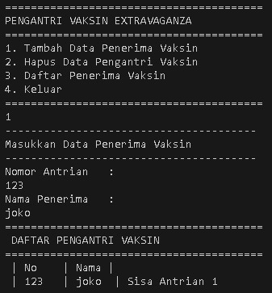
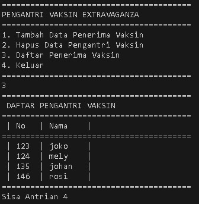
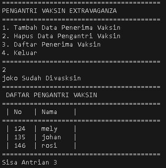

# <p align ="center">  LAPORAN PRAKTIKUM ALGORITMA DAN STRUKTUR DATA </p>
# <p align ="center">  PRAKTIKUM 12 </p>
<br><br><br><br>

<p align="center">
    </p>

<br><br><br><br><br>

<p align = "center"> Nama       : ESA PRATAMA PUTRI </p>
<p align = "center"> NIM        : 2341720061 </p>
<p align = "center"> Kelas / no : TI-1B / 10 </p>
<p align = "center"> Jurusan    : TEKNOLOGI INFORMASI </p>

## 12.2.1 Percobaan 1
```
public class Node10 {

    int data;
    Node10 prev, next;

    Node10(Node10 prev, int data, Node10 next) {
        this.prev = prev;
        this.data = data;
        this.next = next;
    }

    public Node10(int input, Object object) {

    }
}
```

```
public class DoubleLinkedList10 {
    Node10 head;
    int size;

    public DoubleLinkedList10() {
        head = null;
        size = 0;
    }

    public boolean isEmpty() {
        return head == null;
    }

    public void addFirst(int item) {
        if (isEmpty()) {
            head = new Node10(null, item, null);
        } else {
            Node10 newNode = new Node10(null, item, head);
            head.prev = newNode;
            head = newNode;
        }
        size++;
    }

    public void addLast(int item) {
        if (isEmpty()) {
            addFirst(item);
        } else {
            Node10 current = head;
            while (current.next != null) {
                current = current.next;
            }
            Node10 newNode = new Node10(current, item, null);
            current.next = newNode;
            size++;
        }
    }

    public void add(int item, int index) throws Exception {
        if (isEmpty()) {
            addFirst(item);
        } else if (index < 0 || index > size) {
            throw new Exception("Nilai indeks di luar batas");
        } else {
            Node10 current = head;
            int i = 0;
            while (i < index) {
                current = current.next;
                i++;
            }
            if (current.prev == null) {
                Node10 newNode = new Node10(null, item, current);
                current.prev = newNode;
                head = newNode;
            } else {
                Node10 newNode = new Node10(current.prev, item, current);
                newNode.prev = current.prev;
                newNode.next = current;
                current.prev.next = newNode;
                current.prev = newNode;
            }
        }
        size++;
    }

    public int size() {
        return size;
    }

    public void clear() {
        head = null;
        size = 0;
    }

    public void print() {
        if (!isEmpty()) {
            Node10 tmp = head;
            while (tmp != null) {
                System.out.print(tmp.data + "\t");
                tmp = tmp.next;
            }
            System.out.println("\nberhasil diisi");
        } else {
            System.out.println("Linked List Kosong");
        }
    }
}
```

```
public class DoubleLinkedListMain10 {
    public static void main(String[] args) throws Exception {

        DoubleLinkedList10 dll = new DoubleLinkedList10();
        dll.print();
        System.out.println("Size : " + dll.size());
        System.out.println("========================================");
        dll.addFirst(3);
        dll.addLast(4);
        dll.addFirst(7);
        dll.print();
        System.out.println("Size : " + dll.size());
        System.out.println("========================================");
        dll.add(40, 1);
        dll.print();
        System.out.println("Size : " + dll.size());
        System.out.println("========================================");
        dll.clear();
        dll.print();
        System.out.println("Size : " + dll.size());
    }
}
```

## 12.2.2 Verifikasi Hasil Percobaan
 <br>

## 12.2.3 Pertanyaan Percobaan
1. Jelaskan perbedaan antara single linked list dengan double linked lists! <br>
- Single Linked List: Setiap node memiliki satu referensi ke node berikutnya. <br>
- Double Linked List: Setiap node memiliki dua referensi, yaitu ke node sebelumnya (prev) dan ke node berikutnya (next). <br>
2. Perhatikan class Node, di dalamnya terdapat atribut next dan prev. Untuk apakah atribut tersebut? <br>
- Atribut next dan prev dalam kelas Node digunakan untuk menyimpan referensi ke node berikutnya dan node sebelumnya dalam linked list <br>
3. Perhatikan konstruktor pada class DoubleLinkedLists. Apa kegunaan inisialisasi atribut head dan size seperti pada gambar berikut ini? <br>
```
public DoubleLinkedList10() {
        head = null;
        size = 0;
    }
```
- Konstruktor pada kelas DoubleLinkedLists digunakan untuk menginisialisasi atribut head dan size. Inisialisasi head ke null menandakan bahwa linked list awalnya kosong, sedangkan inisialisasi size ke 0 menunjukkan bahwa jumlah elemen dalam linked list awalnya adalah nol <br>
4. Pada method addFirst(), kenapa dalam pembuatan object dari konstruktor class Node prev dianggap sama dengan null? <br>
```
Node newNode = new Node(null, item, head);
```
- Dalam method addFirst(), saat membuat objek dari konstruktor kelas Node, atribut prev diatur ke null karena node yang ditambahkan adalah node pertama dalam linked list <br>
5. Perhatikan pada method addFirst(). Apakah arti statement head.prev = newNode ? <br>
- head.prev = newNode dalam method addFirst() menunjukkan node baru yang ditambahkan sebagai node pertama harus menunjuk ke node sebelumnya, yang sebelumnya adalah nul <br>
6. Perhatikan isi method addLast(), apa arti dari pembuatan object Node dengan mengisikan parameter prev dengan current, dan next dengan null? <br>
```
Node newNode = new Node(current, item, null); 
```
- method addLast(), membuat objek Node dengan mengatur parameter prev ke current dan next ke null mengindikasikan bahwa node baru yang ditambahkan akan menjadi node terakhir dalam linked list <br>
7. Pada method add(), terdapat potongan kode program sebagai berikut:
```
if (current.prev == null) {
                Node10 newNode = new Node10(null, item, current);
                current.prev = newNode;
                head = newNode;
```
jelaskan maksud dari bagian yang ditandai dengan kotak kuning.
- untuk menangani kasus ketika elemen ditambahkan di posisi pertama (indeks 0). Jika current.prev adalah null, ini menunjukkan bahwa node baru akan menjadi node pertama dalam linked list <br>

## 12.3 Kegiatan Praktikum 2
```
public class Node10 {

    int data;
    Node10 prev, next;

    Node10(Node10 prev, int data, Node10 next) {
        this.prev = prev;
        this.data = data;
        this.next = next;
    }

    public Node10(int input, Object object) {

    }
}
```

```
public class DoubleLinkedList10 {
    Node10 head;
    int size;

    public DoubleLinkedList10() {
        head = null;
        size = 0;
    }

    public boolean isEmpty() {
        return head == null;
    }

    public void addFirst(int item) {
        if (isEmpty()) {
            head = new Node10(null, item, null);
        } else {
            Node10 newNode = new Node10(null, item, head);
            head.prev = newNode;
            head = newNode;
        }
        size++;
    }

    public void addLast(int item) {
        if (isEmpty()) {
            addFirst(item);
        } else {
            Node10 current = head;
            while (current.next != null) {
                current = current.next;
            }
            Node10 newNode = new Node10(current, item, null);
            current.next = newNode;
            size++;
        }
    }

    public void add(int item, int index) throws Exception {
        if (isEmpty()) {
            addFirst(item);
        } else if (index < 0 || index > size) {
            throw new Exception("Nilai indeks di luar batas");
        } else {
            Node10 current = head;
            int i = 0;
            while (i < index) {
                current = current.next;
                i++;
            }
            if (current.prev == null) {
                Node10 newNode = new Node10(null, item, current);
                current.prev = newNode;
                head = newNode;
            } else {
                Node10 newNode = new Node10(current.prev, item, current);
                newNode.prev = current.prev;
                newNode.next = current;
                current.prev.next = newNode;
                current.prev = newNode;
            }
        }
        size++;
    }

    public int size() {
        return size;
    }

    public void clear() {
        head = null;
        size = 0;
    }

    public void print() {
        if (!isEmpty()) {
            Node10 tmp = head;
            while (tmp != null) {
                System.out.print(tmp.data + "\t");
                tmp = tmp.next;
            }
            System.out.println("\nberhasil diisi");
        } else {
            System.out.println("Linked List Kosong");
        }
    }

    public void removeFirst() throws Exception {
        if (isEmpty()) {
            throw new Exception("Linked List masih kosong, tidak dapat dihapus!");
        } else if (size == 1) {
            removeLast();
        } else {
            head = head.next;
            head.prev = null;
            size--;
        }
    }

    public void removeLast() throws Exception {
        if (isEmpty()) {
            throw new Exception("Linked List masih kosong, tidak dapat dihapus!");
        } else if (head.next == null) {
            head = null;
            size--;
            return;
        }
        Node10 current = head;
        while (current.next.next != null) {
            current = current.next;
        }
        current.next = null;
        size--;
    }

    public void remove(int index) throws Exception {
        if (isEmpty() || index >= size) {
            throw new Exception("Nilai indeks di luar batas");
        } else if (index == 0) {
            removeFirst();
        } else {
            Node10 current = head;
            int i = 0;
            while (i < index) {
                current = current.next;
                i++;
            }
            if (current.next == null) {
                current.prev.next = null;
            } else if (current.prev == null) {
                current = current.next;
                current.prev = null;
                head = current;
            } else {
                current.prev.next = current.next;
                current.next.prev = current.prev;
            }
            size--;
        }
    }
}
```

```
public class DoubleLinkedListMain10 {
    public static void main(String[] args) throws Exception {

        DoubleLinkedList10 dll = new DoubleLinkedList10();
        dll.print();
        System.out.println("Size : " + dll.size());
        System.out.println("========================================");
        dll.addFirst(3);
        dll.addLast(4);
        dll.addFirst(7);
        dll.print();
        System.out.println("Size : " + dll.size());
        System.out.println("========================================");
        dll.add(40, 1);
        dll.print();
        System.out.println("Size : " + dll.size());
        System.out.println("========================================");
        dll.clear();
        dll.print();
        System.out.println("Size : " + dll.size());

        dll.addLast(50);
        dll.addLast(40);
        dll.addLast(10);
        dll.addLast(20);
        dll.print();

        System.out.println("Size : " + dll.size());
        System.out.println("========================================");
        dll.removeFirst();
        dll.print();
        System.out.println("Size : " + dll.size());
        System.out.println("========================================");
        dll.removeLast();
        dll.print();
        System.out.println("Size : " + dll.size());
        System.out.println("========================================");
        dll.remove(1);
        dll.print();
        System.out.println("Size : " + dll.size());
    }
}
```

## 12.3.2 Verifikasi Hasil Percobaan
 <br>

## 12.3.3 Pertanyaan Percobaan
1. Apakah maksud statement berikut pada method removeFirst()? <br>
```
head = head.next;
head.prev = null;
```
- method removeFirst(), statement head = head.next; bertujuan untuk menggeser referensi head ke node berikutnya setelah node pertama dihapus <br> 
- head.prev = null; mengatur referensi prev dari node baru yang menjadi node pertama menjadi null, karena node baru tersebut tidak memiliki node sebelumnya <br>
2. Bagaimana cara mendeteksi posisi data ada pada bagian akhir pada method removeLast()? <br>
dalam method removeLast(), perlu melakukan pengecekan apakah node terakhir memiliki referensi next yang kosong (null). Jika current.next == null, ini menunjukkan bahwa node saat ini adalah node terakhir dalam linked list <br>
3. Jelaskan alasan potongan kode program di bawah ini tidak cocok untuk perintah remove! <br>
```
Node tmp = head.next;

head.next=temp.next;
tmp.next.prev=head;
```
- untuk menghapus suatu node dari struktur data linked list ganda (doubly linked list) <br>
4. Jelaskan fungsi kode program berikut ini pada fungsi remove! <br>
```
current.prev.next = current.next;
                current.next.prev = current.prev;
```
- current.prev.next = current.next; dan current.next.prev = current.prev; berfungsi untuk menghapus node current dari linked list <br>
- current.prev.next = current.next; mengatur referensi next dari node sebelum current agar menunjuk ke node setelah curren <br>
- current.next.prev = current.prev; mengatur referensi prev dari node setelah current agar menunjuk ke node sebelum current <br>

## 12.4 Kegiatan Praktikum 3
```
public class Node10 {

    int data;
    Node10 prev, next;

    Node10(Node10 prev, int data, Node10 next) {
        this.prev = prev;
        this.data = data;
        this.next = next;
    }

    public Node10(int input, Object object) {

    }
}
```

```
public class DoubleLinkedList10 {
    Node10 head;
    int size;

    public DoubleLinkedList10() {
        head = null;
        size = 0;
    }

    public boolean isEmpty() {
        return head == null;
    }

    public void addFirst(int item) {
        if (isEmpty()) {
            head = new Node10(null, item, null);
        } else {
            Node10 newNode = new Node10(null, item, head);
            head.prev = newNode;
            head = newNode;
        }
        size++;
    }

    public void addLast(int item) {
        if (isEmpty()) {
            addFirst(item);
        } else {
            Node10 current = head;
            while (current.next != null) {
                current = current.next;
            }
            Node10 newNode = new Node10(current, item, null);
            current.next = newNode;
            size++;
        }
    }

    public void add(int item, int index) throws Exception {
        if (isEmpty()) {
            addFirst(item);
        } else if (index < 0 || index > size) {
            throw new Exception("Nilai indeks di luar batas");
        } else {
            Node10 current = head;
            int i = 0;
            while (i < index) {
                current = current.next;
                i++;
            }
            if (current.prev == null) {
                Node10 newNode = new Node10(null, item, current);
                current.prev = newNode;
                head = newNode;
            } else {
                Node10 newNode = new Node10(current.prev, item, current);
                newNode.prev = current.prev;
                newNode.next = current;
                current.prev.next = newNode;
                current.prev = newNode;
            }
        }
        size++;
    }

    public int size() {
        return size;
    }

    public void clear() {
        head = null;
        size = 0;
    }

    public void print() {
        if (!isEmpty()) {
            Node10 tmp = head;
            while (tmp != null) {
                System.out.print(tmp.data + "\t");
                tmp = tmp.next;
            }
            System.out.println("\nberhasil diisi");
        } else {
            System.out.println("Linked List Kosong");
        }
    }

    public void removeFirst() throws Exception {
        if (isEmpty()) {
            throw new Exception("Linked List masih kosong, tidak dapat dihapus!");
        } else if (size == 1) {
            removeLast();
        } else {
            head = head.next;
            head.prev = null;
            size--;
        }
    }

    public void removeLast() throws Exception {
        if (isEmpty()) {
            throw new Exception("Linked List masih kosong, tidak dapat dihapus!");
        } else if (head.next == null) {
            head = null;
            size--;
            return;
        }
        Node10 current = head;
        while (current.next.next != null) {
            current = current.next;
        }
        current.next = null;
        size--;
    }

    public void remove(int index) throws Exception {
        if (isEmpty() || index >= size) {
            throw new Exception("Nilai indeks di luar batas");
        } else if (index == 0) {
            removeFirst();
        } else {
            Node10 current = head;
            int i = 0;
            while (i < index) {
                current = current.next;
                i++;
            }
            if (current.next == null) {
                current.prev.next = null;
            } else if (current.prev == null) {
                current = current.next;
                current.prev = null;
                head = current;
            } else {
                current.prev.next = current.next;
                current.next.prev = current.prev;
            }
            size--;
        }
    }

    public int getFirst() throws Exception {
        if (isEmpty()) {
            throw new Exception("linked List kosong");
        }
        return head.data;
    }

    public int getLast() throws Exception {
        if (isEmpty()) {
            throw new Exception("Linked List kosng");
        }
        Node10 tmp = head;
        while (tmp.next != null) {
            tmp = tmp.next;
        }
        return tmp.data;
    }

    public int get(int index) throws Exception {
        if (isEmpty() || index >= size) {
            throw new Exception("Nilai indeks di luar batas.");
        }
        Node10 tmp = head;
        for (int i = 0; i < index; i++) {
            tmp = tmp.next;
        }
        return tmp.data;
    }
}
```

```
public class DoubleLinkedListMain10 {
    public static void main(String[] args) throws Exception {

        DoubleLinkedList10 dll = new DoubleLinkedList10();
        dll.print();
        System.out.println("Size : " + dll.size());
        System.out.println("========================================");
        dll.addFirst(3);
        dll.addLast(4);
        dll.addFirst(7);
        dll.print();
        System.out.println("Size : " + dll.size());
        System.out.println("========================================");
        dll.add(40, 1);
        dll.print();
        System.out.println("Size : " + dll.size());
        System.out.println("========================================");
        dll.clear();
        dll.print();
        System.out.println("Size : " + dll.size());

        dll.addLast(50);
        dll.addLast(40);
        dll.addLast(10);
        dll.addLast(20);
        dll.print();

        System.out.println("Size : " + dll.size());
        System.out.println("========================================");
        dll.removeFirst();
        dll.print();
        System.out.println("Size : " + dll.size());
        System.out.println("========================================");
        dll.removeLast();
        dll.print();
        System.out.println("Size : " + dll.size());
        System.out.println("========================================");
        dll.remove(1);
        dll.print();
        System.out.println("Size : " + dll.size());

        dll.print();
        System.out.println("Size: " + dll.size());
        System.out.println("========================================");
        dll.addFirst(3);
        dll.addLast(4);
        dll.addFirst(7);
        dll.print();
        System.out.println("Size: " + dll.size());
        System.out.println("========================================");
        System.out.println("Data awal pada Linked List adalah: " + dll.getFirst());
        System.out.println("Data akhir pada Linked List adalah: " + dll.getLast());
        System.out.println("Data indeks ke-1 pada Linked List adalah: " + dll.get(1));
    }
}
```

## 12.4.2 Verifikasi Hasil Percobaan
 <br>
 <br>

## 12.4.3 Pertanyaan Percobaan
1. Jelaskan method size() pada class DoubleLinkedLists! <br>
- method mengembalikan jumlah elemen (node) yang ada dalam linked list. Pada implementasinya, method ini mengakses atribut size yang menyimpan informasi tentang jumlah elemen dalam linked list, kemudian mengembalikan nilai size tersebut <br>
2. Jelaskan cara mengatur indeks pada double linked lists supaya dapat dimulai dari indeks ke1! <br>
untuk nilai awal indeks ke-1 dan kemudian menyesuaikan operasi-operasi yang dilakukan pada linked list, seperti penambahan, penghapusan, atau pencarian elemen, untuk memperhitungkan pergeseran indeks. <br>
3. Jelaskan perbedaan karakteristik fungsi Add pada Double Linked Lists dan Single Linked Lists! <br>
- Double Linked Lists (DLL) :  Pada DLL, penambahan elemen baru dapat dilakukan di kedua ujung linked list (pertama atau terakhir), serta di tengah-tengah linked list <br>
- Single Linked Lists (SLL) : Pada SLL, penambahan elemen baru terbatas pada ujung-ujung linked list (pertama atau terakhir) <br>
4. Jelaskan perbedaan logika dari kedua kode program di bawah ini! <br>
```
public boolean isEmpty() {
    if(size ==0) {
        return true;
    } else {
        return false;
    }
}
```

```
public boolean isEmpty() {
        return head == null;
    }
```
- memeriksa apakah suatu struktur data (seperti linked list) kosong, tetapi mereka melakukannya dengan cara yang berbeda dan bergantung pada atribut yang berbeda <br>

## 12.5 Tugas Praktikum
1. Buat program antrian vaksinasi menggunakan queue berbasis double linked list sesuai ilustrasi dan menu di bawah ini! (counter jumlah antrian tersisa di menu cetak(3) dan data orang yang telah divaksinasi di menu Hapus Data(2) harus ada) <br>
```
public class Node10 {
    int no;
    String nama;
    Node10 prev, next;

    Node10(int no, String nama) {
        this.prev = prev;
        this.no = no;
        this.nama = nama;
        this.next = next;
    }
}
```

```
public class DoubleLinkedList10 {

    Node10 head, tail;
    int size;

    public DoubleLinkedList10() {
        head = null;
        tail = null;
        size = 0;
    }

    public boolean isEmpty() {
        return head == null;
    }

    public void addLast(int no, String nama) {
        if (isEmpty()) {
            head = new Node10(no, nama);
        } else {
            Node10 current = head;
            while (current.next != null) {
                current = current.next;
            }
            Node10 newNode10 = new Node10(no, nama);
            current.next = newNode10;
            tail = newNode10;

        }
        size++;
    }

    public void removeFirst() throws Exception {
        if (isEmpty()) {
            throw new Exception("Linked List masih kosong, tidak dapat dihapus!");
        } else if (size == 0) {
            removeLast();
        } else {
            System.out.println(head.nama + " Sudah divaksin");
            head = head.next;
            head.prev = null;
            size--;
        }
    }

    public void removeLast() throws Exception {
        if (isEmpty()) {
            throw new Exception("Linked List masih kosong, tidak dapat dihapus!");
        } else if (head.next == null) {
            System.out.println(head.nama + " Sudah divaksin");
            head = null;
            tail = null;
            size--;
            return;
        }
        Node10 current = head;
        while (current.next.next != null) {
            current = current.next;
        }
        current.next = null;
        size--;
    }

    public void enqueue(int no, String nama) {
        // Node10 newNode10 = new Node10(no, nama);
        if (isEmpty()) {
            // head = tail = newNode10;
            addLast(no, nama);
        } else {
            Node10 newNode10 = new Node10(no, nama);
            tail.next = newNode10;
            newNode10.prev = tail;
            tail = newNode10;
        }
        size++;
    }

    void Dequeue() {
        if (isEmpty()) {
            System.out.println("Linked List Kosong");
        } else {
            Node10 removedNode10 = head;
            head = head.next;
            if (head != null) {
                head.prev = null;
            } else {
                tail = null;
            }
            size--;
            System.out.println(removedNode10.nama + " Sudah Divasksin");
        }
    }

    public void printQueue() {
        System.out.println("========================================");
        System.out.println(" DAFTAR PENGANTRI VAKSIN ");
        System.out.println("========================================");
        System.out.println(" | No \t | Nama" + " | ");
        if (!isEmpty()) {
            Node10 tmp = head;
            while (tmp != null) {
                System.out.print(" | " + tmp.no + "\t | " + tmp.nama + "\t | ");
                tmp = tmp.next;
            }
            System.out.println("Sisa Antrian " + size);
        } else {
            System.out.println("Linked List Kosong");
        }
    }
}
```

```
import java.util.Scanner;

public class DoubleLinkedListMain10 {

    public static void menu() {
        System.out.println("========================================");
        System.out.println("PENGANTRI VAKSIN EXTRAVAGANZA");
        System.out.println("========================================");
        System.out.println("1. Tambah Data Penerima Vaksin");
        System.out.println("2. Hapus Data Pengantri Vaksin");
        System.out.println("3. Daftar Penerima Vaksin");
        System.out.println("4. Keluar");
        System.out.println("========================================");
    }

    public static void main(String[] args) throws Exception {
        try (Scanner sc10 = new Scanner(System.in)) {
            DoubleLinkedList10 dll = new DoubleLinkedList10();

            int pilih;
            do {
                menu();
                pilih = sc10.nextInt();
                sc10.nextLine();

                switch (pilih) {
                    case 1:
                        System.out.println("---------------------------------------");
                        System.out.println("Masukkan Data Penerima Vaksin");
                        System.out.println("---------------------------------------");
                        System.out.println("Nomor Antrian\t: ");
                        int nim = sc10.nextInt();
                        System.out.println("Nama Penerima \t:");
                        String nama = sc10.next();
                        dll.addLast(nim, nama);
                        sc10.nextLine();
                        dll.printQueue();
                        break;

                    case 2:
                        dll.Dequeue();
                        // dll.printQueue();

                    case 3:
                        dll.printQueue();
                        break;

                    case 4:
                        System.exit(0);
                        break;

                }
            } while (pilih == 1 || pilih == 2 || pilih == 3 || pilih == 4);
        }
    }
}
```
- OUTPUT
 <br>
 <br>
 <br>

2. Buatlah program daftar film yang terdiri dari id, judul dan rating menggunakan double linked lists, bentuk program memiliki fitur pencarian melalui ID Film dan pengurutan Rating secara descending. Class Film wajib diimplementasikan dalam soal ini. <br>