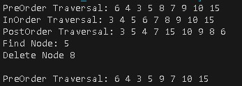

# <p align ="center">  LAPORAN PRAKTIKUM ALGORITMA DAN STRUKTUR DATA </p>
# <p align ="center">  PRAKTIKUM 13 </p>
<br><br><br><br>

<p align="center">
    </p>

<br><br><br><br><br>

<p align = "center"> Nama       : ESA PRATAMA PUTRI </p>
<p align = "center"> NIM        : 2341720061 </p>
<p align = "center"> Kelas / no : TI-1B / 10 </p>
<p align = "center"> Jurusan    : TEKNOLOGI INFORMASI </p>

## 13.2.1 Percobaan 1
- Input <br>
```
public class Node10 {
    int data;
    Node10 left;
    Node10 right;

    public Node10(int data) {
        this.data = data;
        this.left = null;
        this.right = null;
    }

    public Node10() {
        this.data = 0;
        this.left = null;
        this.right = null;
    }
}
```
```
public class BinaryTree10 {

    Node10 root;

    public BinaryTree10() {
        root = null;
    }

    boolean isEmpty() {
        return root == null;
    }

    void add(int data) {
        root = addRecursive(root, data);
    }

    private Node10 addRecursive(Node10 current, int data) {
        if (current == null) {
            return new Node10(data);
        }

        if (data < current.data) {
            current.left = addRecursive(current.left, data);
        } else if (data > current.data) {
            current.right = addRecursive(current.right, data);
        }

        return current;
    }

    Node10 find(int data) {
        return findRecursive(root, data);
    }

    private Node10 findRecursive(Node10 current, int data) {
        if (current == null || current.data == data) {
            return current;
        }

        if (data < current.data) {
            return findRecursive(current.left, data);
        } else {
            return findRecursive(current.right, data);
        }
    }

    void traversePreOrder(Node10 node) {
        if (node != null) {
            System.out.print(node.data + " ");
            traversePreOrder(node.left);
            traversePreOrder(node.right);
        }
    }

    void traversePostOrder(Node10 node) {
        if (node != null) {
            traversePostOrder(node.left);
            traversePostOrder(node.right);
            System.out.print(node.data + " ");
        }
    }

    void traverseInOrder(Node10 node) {
        if (node != null) {
            traverseInOrder(node.left);
            System.out.print(node.data + " ");
            traverseInOrder(node.right);
        }
    }

    Node10 getSuccessor(Node10 del) {
        Node10 successor = del.right;
        Node10 successorParent = del;
        while (successor.left != null) {
            successorParent = successor;
            successor = successor.left;
        }
        if (successor != del.right) {
            successorParent.left = successor.right;
            successor.right = del.right;
        }
        return successor;
    }

    void delete(int data) {
        root = deleteRecursive(root, data);
    }

    private Node10 deleteRecursive(Node10 current, int data) {
        if (current == null) {
            return null;
        }

        if (data == current.data) {
            if (current.left == null && current.right == null) {
                return null;
            }
            if (current.left == null) {
                return current.right;
            }
            if (current.right == null) {
                return current.left;
            }
            int smallestValue = findSmallestValue(current.right);
            current.data = smallestValue;
            current.right = deleteRecursive(current.right, smallestValue);
            return current;
        }

        if (data < current.data) {
            current.left = deleteRecursive(current.left, data);
        } else {
            current.right = deleteRecursive(current.right, data);
        }

        return current;
    }

    private int findSmallestValue(Node10 root) {
        return root.left == null ? root.data : findSmallestValue(root.left);
    }
}
```
```
public class BinaryTree10 {

    Node10 root;

    public BinaryTree10() {
        root = null;
    }

    boolean isEmpty() {
        return root == null;
    }

    void add(int data) {
        root = addRecursive(root, data);
    }

    private Node10 addRecursive(Node10 current, int data) {
        if (current == null) {
            return new Node10(data);
        }

        if (data < current.data) {
            current.left = addRecursive(current.left, data);
        } else if (data > current.data) {
            current.right = addRecursive(current.right, data);
        }

        return current;
    }

    Node10 find(int data) {
        return findRecursive(root, data);
    }

    private Node10 findRecursive(Node10 current, int data) {
        if (current == null || current.data == data) {
            return current;
        }

        if (data < current.data) {
            return findRecursive(current.left, data);
        } else {
            return findRecursive(current.right, data);
        }
    }

    void traversePreOrder(Node10 node) {
        if (node != null) {
            System.out.print(node.data + " ");
            traversePreOrder(node.left);
            traversePreOrder(node.right);
        }
    }

    void traversePostOrder(Node10 node) {
        if (node != null) {
            traversePostOrder(node.left);
            traversePostOrder(node.right);
            System.out.print(node.data + " ");
        }
    }

    void traverseInOrder(Node10 node) {
        if (node != null) {
            traverseInOrder(node.left);
            System.out.print(node.data + " ");
            traverseInOrder(node.right);
        }
    }

    Node10 getSuccessor(Node10 del) {
        Node10 successor = del.right;
        Node10 successorParent = del;
        while (successor.left != null) {
            successorParent = successor;
            successor = successor.left;
        }
        if (successor != del.right) {
            successorParent.left = successor.right;
            successor.right = del.right;
        }
        return successor;
    }

    void delete(int data) {
        root = deleteRecursive(root, data);
    }

    private Node10 deleteRecursive(Node10 current, int data) {
        if (current == null) {
            return null;
        }

        if (data == current.data) {
            if (current.left == null && current.right == null) {
                return null;
            }
            if (current.left == null) {
                return current.right;
            }
            if (current.right == null) {
                return current.left;
            }
            int smallestValue = findSmallestValue(current.right);
            current.data = smallestValue;
            current.right = deleteRecursive(current.right, smallestValue);
            return current;
        }

        if (data < current.data) {
            current.left = deleteRecursive(current.left, data);
        } else {
            current.right = deleteRecursive(current.right, data);
        }

        return current;
    }

    private int findSmallestValue(Node10 root) {
        return root.left == null ? root.data : findSmallestValue(root.left);
    }
}
```

```
public class BinaryTreeMain10 {

    public static void main(String[] args) {
        BinaryTree10 bt = new BinaryTree10();

        bt.add(6);
        bt.add(4);
        bt.add(8);
        bt.add(3);
        bt.add(5);
        bt.add(7);
        bt.add(9);
        bt.add(10);
        bt.add(15);

        System.out.print("PreOrder Traversal: ");
        bt.traversePreOrder(bt.root);
        System.out.println("");

        System.out.print("InOrder Traversal: ");
        bt.traverseInOrder(bt.root);
        System.out.println("");

        System.out.print("PostOrder Traversal: ");
        bt.traversePostOrder(bt.root);
        System.out.println("");

        Node10 foundNode = bt.find(5);
        if (foundNode != null) {
            System.out.println("Find Node: " + foundNode.data);
        } else {
            System.out.println("Node with value 5 not found.");
        }

        System.out.println("Delete Node 8 ");
        bt.delete(8);
        System.out.println("");

        System.out.print("PreOrder Traversal: ");
        bt.traversePreOrder(bt.root);
        System.out.println("");
    }
}
```
- Output <br>
 <br>

## 13.2.2 Pertanyaan Percobaan
1. Mengapa dalam binary search tree proses pencarian data bisa lebih efektif dilakukan dibanding binary tree biasa? <br>
- karena setiap node memiliki nilai yang terorganisir, di mana nilai di subtree kiri lebih kecil dan nilai di subtree kanan lebih besar. Hal ini memungkinkan pencarian menggunakan metode pencarian biner, di mana pencarian hanya perlu dilakukan pada satu sisi subtree tergantung pada perbandingan nilai dengan node saat ini. <br>
2. Untuk apakah di class Node, kegunaan dari atribut left dan right? <br>
- pada struktur pohon biner, atribut left dan right digunakan untuk menunjukkan node anak kiri dan node anak kanan dari node saat ini, secara berurutan <br>
3. a. Untuk apakah kegunaan dari atribut root di dalam class BinaryTree? <br>
- digunakan untuk menunjukkan akar (root) dari pohon biner. Root adalah node pertama dari pohon biner, dan semua node lainnya diakses melalui root <br>
   b. Ketika objek tree pertama kali dibuat, apakah nilai dari root? <br>
- Ketika objek tree pertama kali dibuat, nilai dari root akan null, karena pada awalnya pohon tersebut belum memiliki node apa pun <br>
4. Ketika tree masih kosong, dan akan ditambahkan sebuah node baru, proses apa yang akan terjadi? <br>
- node baru akan menjadi root dari pohon, dan nilai dari root akan ditetapkan sebagai node baru yang akan ditambahkan <br>
5. Perhatikan method add(), di dalamnya terdapat baris program seperti di bawah ini. Jelaskan secara detil untuk apa baris programn tersebut? <br>
```
if(data<current.data){
 if(current.left!=null){
 current = current.left;
 }else{
 current.left = new Node(data);
 break;
 }
}
```
- Baris program tersebut bertanggung jawab untuk menambahkan node baru ke dalam pohon biner. Pada setiap langkah, algoritma menelusuri pohon berdasarkan nilai data yang akan ditambahkan, membandingkannya dengan nilai node saat ini. Jika nilai data kurang dari nilai node saat ini, maka algoritma bergerak ke anak kiri dari node saat ini. Jika node anak kiri sudah ada, algoritma memperbarui node saat ini menjadi anak kiri dan melanjutkan pencarian. Jika node anak kiri belum ada, algoritma menambahkan node baru sebagai anak kiri dari node saat ini dan menghentikan proses <br>

## 13.3 Kegiatan Praktikum 2
- Input <br>
```
public class BinaryTreeArray10 {

    int[] data;
    int idxLast;

    public BinaryTreeArray10() {
        data = new int[10];
    }

    void populateData(int[] data, int idxLast) {
        this.data = data;
        this.idxLast = idxLast;
    }

    void traverseInOrder(int idxStart) {
        if (idxStart <= idxLast) {
            traverseInOrder(2 * idxStart + 1);
            System.out.print(data[idxStart] + " ");
            traverseInOrder(2 * idxStart + 2);
        }
    }
}
```

```
public class BinaryTreeArrayMain10 {

    public static void main(String[] args) {
        BinaryTreeArray10 bta = new BinaryTreeArray10();
        int[] data = { 6, 4, 8, 3, 5, 7, 9, 0, 0, 0 };
        int idxLast = 6;
        bta.populateData(data, idxLast);

        System.out.print("\nInOrder Traversal : ");
        bta.traverseInOrder(0);
        System.out.println("\n");
    }
}
```
- Output <br>
 <br>

## 13.3.2 Pertanyaan Percobaan
1. Apakah kegunaan dari atribut data dan idxLast yang ada di class BinaryTreeArray? <br>
- Atribut data digunakan untuk menyimpan nilai-nilai yang mewakili node-node dalam pohon biner yang diimplementasikan sebagai array <br>
- Atribut idxLast digunakan untuk menyimpan indeks terakhir dari array data yang berisi data aktual dalam pohon biner <br>
2. Apakah kegunaan dari method populateData()? <br>
- digunakan untuk mengisi array data dalam objek BinaryTreeArray dengan nilai-nilai yang diberikan <br>
3. Apakah kegunaan dari method traverseInOrder()? <br>
- digunakan untuk melakukan traversal inorder pada pohon biner yang direpresentasikan dalam bentuk array, dimulai dari indeks idxStart. Traversal inorder mengunjungi node-node dalam pohon secara berurutan mulai dari node kiri, kemudian node saat ini, dan terakhir node kanan <br>
4. Jika suatu node binary tree disimpan dalam array indeks 2, maka di indeks berapakah posisi left child dan rigth child masin-masing? <br>
- Left child: 2 * 2 + 1 = 5 <br>
- Right child: 2 * 2 + 2 = 6 <br>
5. Apa kegunaan statement int idxLast = 6 pada praktikum 2 percobaan nomor 4? <br>
- digunakan untuk menunjukkan bahwa indeks terakhir dari data yang valid dalam array adalah 6 <br>

## 13.4 Tugas Praktikum
1. Buat method di dalam class BinaryTree yang akan menambahkan node dengan cara rekursif. <br>
```
public class BinaryTree10 {

    Node10 root;

    public BinaryTree10() {
        root = null;
    }

    boolean isEmpty() {
        return root == null;
    }

    void add(int data) {
        root = addRecursive(root, data);
    }

    // menambahkan method recursive
    private Node10 addRecursive(Node10 current, int data) {
        if (current == null) {
            return new Node10(data);
        }

        if (data < current.data) {
            current.left = addRecursive(current.left, data);
        } else if (data > current.data) {
            current.right = addRecursive(current.right, data);
        }

        return current;
    }

    Node10 find(int data) {
        return findRecursive(root, data);
    }

    private Node10 findRecursive(Node10 current, int data) {
        if (current == null || current.data == data) {
            return current;
        }

        if (data < current.data) {
            return findRecursive(current.left, data);
        } else {
            return findRecursive(current.right, data);
        }
    }

    void traversePreOrder(Node10 node) {
        if (node != null) {
            System.out.print(node.data + " ");
            traversePreOrder(node.left);
            traversePreOrder(node.right);
        }
    }

    void traversePostOrder(Node10 node) {
        if (node != null) {
            traversePostOrder(node.left);
            traversePostOrder(node.right);
            System.out.print(node.data + " ");
        }
    }

    void traverseInOrder(Node10 node) {
        if (node != null) {
            traverseInOrder(node.left);
            System.out.print(node.data + " ");
            traverseInOrder(node.right);
        }
    }

    Node10 getSuccessor(Node10 del) {
        Node10 successor = del.right;
        Node10 successorParent = del;
        while (successor.left != null) {
            successorParent = successor;
            successor = successor.left;
        }
        if (successor != del.right) {
            successorParent.left = successor.right;
            successor.right = del.right;
        }
        return successor;
    }

    void delete(int data) {
        root = deleteRecursive(root, data);
    }

    private Node10 deleteRecursive(Node10 current, int data) {
        if (current == null) {
            return null;
        }

        if (data == current.data) {
            if (current.left == null && current.right == null) {
                return null;
            }
            if (current.left == null) {
                return current.right;
            }
            if (current.right == null) {
                return current.left;
            }
            int smallestValue = findSmallestValue(current.right);
            current.data = smallestValue;
            current.right = deleteRecursive(current.right, smallestValue);
            return current;
        }

        if (data < current.data) {
            current.left = deleteRecursive(current.left, data);
        } else {
            current.right = deleteRecursive(current.right, data);
        }

        return current;
    }

    private int findSmallestValue(Node10 root) {
        return root.left == null ? root.data : findSmallestValue(root.left);
    }
}
```
2. Buat method di dalam class BinaryTree untuk menampilkan nilai paling kecil dan yang paling besar yang ada di dalam tree. <br>
```
public class BinaryTree10 {

    Node10 root;

    public BinaryTree10() {
        root = null;
    }

    boolean isEmpty() {
        return root == null;
    }

    void add(int data) {
        root = addRecursive(root, data);
    }

    // menambahkan method recursive
    private Node10 addRecursive(Node10 current, int data) {
        if (current == null) {
            return new Node10(data);
        }

        if (data < current.data) {
            current.left = addRecursive(current.left, data);
        } else if (data > current.data) {
            current.right = addRecursive(current.right, data);
        }

        return current;
    }

    Node10 find(int data) {
        return findRecursive(root, data);
    }

    private Node10 findRecursive(Node10 current, int data) {
        if (current == null || current.data == data) {
            return current;
        }

        if (data < current.data) {
            return findRecursive(current.left, data);
        } else {
            return findRecursive(current.right, data);
        }
    }

    void traversePreOrder(Node10 node) {
        if (node != null) {
            System.out.print(node.data + " ");
            traversePreOrder(node.left);
            traversePreOrder(node.right);
        }
    }

    void traversePostOrder(Node10 node) {
        if (node != null) {
            traversePostOrder(node.left);
            traversePostOrder(node.right);
            System.out.print(node.data + " ");
        }
    }

    void traverseInOrder(Node10 node) {
        if (node != null) {
            traverseInOrder(node.left);
            System.out.print(node.data + " ");
            traverseInOrder(node.right);
        }
    }

    Node10 getSuccessor(Node10 del) {
        Node10 successor = del.right;
        Node10 successorParent = del;
        while (successor.left != null) {
            successorParent = successor;
            successor = successor.left;
        }
        if (successor != del.right) {
            successorParent.left = successor.right;
            successor.right = del.right;
        }
        return successor;
    }

    void delete(int data) {
        root = deleteRecursive(root, data);
    }

    private Node10 deleteRecursive(Node10 current, int data) {
        if (current == null) {
            return null;
        }

        if (data == current.data) {
            if (current.left == null && current.right == null) {
                return null;
            }
            if (current.left == null) {
                return current.right;
            }
            if (current.right == null) {
                return current.left;
            }
            int smallestValue = findSmallestValue(current.right);
            current.data = smallestValue;
            current.right = deleteRecursive(current.right, smallestValue);
            return current;
        }

        if (data < current.data) {
            current.left = deleteRecursive(current.left, data);
        } else {
            current.right = deleteRecursive(current.right, data);
        }

        return current;
    }

    private int findSmallestValue(Node10 root) {
        return root.left == null ? root.data : findSmallestValue(root.left);
    }

    // menambahkan method nilai yang paling kecil
    public int findMinValue() {
        if (isEmpty()) {
            System.out.println("Tree is empty.");
            return Integer.MIN_VALUE;
        }
        Node10 current = root;
        while (current.left != null) {
            current = current.left;
        }
        return current.data;
    }

    // menambahkan method nilai yang paling besar
    public int findMaxValue() {
        if (isEmpty()) {
            System.out.println("Tree is empty.");
            return Integer.MAX_VALUE;
        }
        Node10 current = root;
        while (current.right != null) {
            current = current.right;
        }
        return current.data;
    }
}
```
3. Buat method di dalam class BinaryTree untuk menampilkan data yang ada di leaf. <br>
```
public class BinaryTree10 {

    Node10 root;

    public BinaryTree10() {
        root = null;
    }

    boolean isEmpty() {
        return root == null;
    }

    void add(int data) {
        root = addRecursive(root, data);
    }

    // menambahkan method recursive
    private Node10 addRecursive(Node10 current, int data) {
        if (current == null) {
            return new Node10(data);
        }

        if (data < current.data) {
            current.left = addRecursive(current.left, data);
        } else if (data > current.data) {
            current.right = addRecursive(current.right, data);
        }

        return current;
    }

    Node10 find(int data) {
        return findRecursive(root, data);
    }

    private Node10 findRecursive(Node10 current, int data) {
        if (current == null || current.data == data) {
            return current;
        }

        if (data < current.data) {
            return findRecursive(current.left, data);
        } else {
            return findRecursive(current.right, data);
        }
    }

    void traversePreOrder(Node10 node) {
        if (node != null) {
            System.out.print(node.data + " ");
            traversePreOrder(node.left);
            traversePreOrder(node.right);
        }
    }

    void traversePostOrder(Node10 node) {
        if (node != null) {
            traversePostOrder(node.left);
            traversePostOrder(node.right);
            System.out.print(node.data + " ");
        }
    }

    void traverseInOrder(Node10 node) {
        if (node != null) {
            traverseInOrder(node.left);
            System.out.print(node.data + " ");
            traverseInOrder(node.right);
        }
    }

    Node10 getSuccessor(Node10 del) {
        Node10 successor = del.right;
        Node10 successorParent = del;
        while (successor.left != null) {
            successorParent = successor;
            successor = successor.left;
        }
        if (successor != del.right) {
            successorParent.left = successor.right;
            successor.right = del.right;
        }
        return successor;
    }

    void delete(int data) {
        root = deleteRecursive(root, data);
    }

    private Node10 deleteRecursive(Node10 current, int data) {
        if (current == null) {
            return null;
        }

        if (data == current.data) {
            if (current.left == null && current.right == null) {
                return null;
            }
            if (current.left == null) {
                return current.right;
            }
            if (current.right == null) {
                return current.left;
            }
            int smallestValue = findSmallestValue(current.right);
            current.data = smallestValue;
            current.right = deleteRecursive(current.right, smallestValue);
            return current;
        }

        if (data < current.data) {
            current.left = deleteRecursive(current.left, data);
        } else {
            current.right = deleteRecursive(current.right, data);
        }

        return current;
    }

    private int findSmallestValue(Node10 root) {
        return root.left == null ? root.data : findSmallestValue(root.left);
    }

    // menambahkan method nilai yang paling kecil
    public int findMinValue() {
        if (isEmpty()) {
            System.out.println("Tree is empty.");
            return Integer.MIN_VALUE;
        }
        Node10 current = root;
        while (current.left != null) {
            current = current.left;
        }
        return current.data;
    }

    // menambahkan method nilai yang paling besar
    public int findMaxValue() {
        if (isEmpty()) {
            System.out.println("Tree is empty.");
            return Integer.MAX_VALUE;
        }
        Node10 current = root;
        while (current.right != null) {
            current = current.right;
        }
        return current.data;
    }

    // menambahkan method untuk menampilkan data di leaf nodes
    public void displayLeafNodes() {
        if (isEmpty()) {
            System.out.println("Tree is empty.");
            return;
        }
        System.out.print("Leaf nodes: ");
        displayLeafNodesRecursive(root);
        System.out.println();
    }

    // menambahkan method rekursif untuk menampilkan data di leaf nodes
    private void displayLeafNodesRecursive(Node10 node) {
        if (node != null) {
            if (node.left == null && node.right == null) {
                System.out.print(node.data + " ");
            }
            displayLeafNodesRecursive(node.left);
            displayLeafNodesRecursive(node.right);
        }
    }
}
```
4. Buat method di dalam class BinaryTree untuk menampilkan berapa jumlah leaf yang ada di dalam tree. <br>
```
public class BinaryTree10 {

    Node10 root;

    public BinaryTree10() {
        root = null;
    }

    boolean isEmpty() {
        return root == null;
    }

    void add(int data) {
        root = addRecursive(root, data);
    }

    // menambahkan method recursive
    private Node10 addRecursive(Node10 current, int data) {
        if (current == null) {
            return new Node10(data);
        }

        if (data < current.data) {
            current.left = addRecursive(current.left, data);
        } else if (data > current.data) {
            current.right = addRecursive(current.right, data);
        }

        return current;
    }

    Node10 find(int data) {
        return findRecursive(root, data);
    }

    private Node10 findRecursive(Node10 current, int data) {
        if (current == null || current.data == data) {
            return current;
        }

        if (data < current.data) {
            return findRecursive(current.left, data);
        } else {
            return findRecursive(current.right, data);
        }
    }

    void traversePreOrder(Node10 node) {
        if (node != null) {
            System.out.print(node.data + " ");
            traversePreOrder(node.left);
            traversePreOrder(node.right);
        }
    }

    void traversePostOrder(Node10 node) {
        if (node != null) {
            traversePostOrder(node.left);
            traversePostOrder(node.right);
            System.out.print(node.data + " ");
        }
    }

    void traverseInOrder(Node10 node) {
        if (node != null) {
            traverseInOrder(node.left);
            System.out.print(node.data + " ");
            traverseInOrder(node.right);
        }
    }

    Node10 getSuccessor(Node10 del) {
        Node10 successor = del.right;
        Node10 successorParent = del;
        while (successor.left != null) {
            successorParent = successor;
            successor = successor.left;
        }
        if (successor != del.right) {
            successorParent.left = successor.right;
            successor.right = del.right;
        }
        return successor;
    }

    void delete(int data) {
        root = deleteRecursive(root, data);
    }

    private Node10 deleteRecursive(Node10 current, int data) {
        if (current == null) {
            return null;
        }

        if (data == current.data) {
            if (current.left == null && current.right == null) {
                return null;
            }
            if (current.left == null) {
                return current.right;
            }
            if (current.right == null) {
                return current.left;
            }
            int smallestValue = findSmallestValue(current.right);
            current.data = smallestValue;
            current.right = deleteRecursive(current.right, smallestValue);
            return current;
        }

        if (data < current.data) {
            current.left = deleteRecursive(current.left, data);
        } else {
            current.right = deleteRecursive(current.right, data);
        }

        return current;
    }

    private int findSmallestValue(Node10 root) {
        return root.left == null ? root.data : findSmallestValue(root.left);
    }

    // menambahkan method nilai yang paling kecil
    public int findMinValue() {
        if (isEmpty()) {
            System.out.println("Tree is empty.");
            return Integer.MIN_VALUE;
        }
        Node10 current = root;
        while (current.left != null) {
            current = current.left;
        }
        return current.data;
    }

    // menambahkan method nilai yang paling besar
    public int findMaxValue() {
        if (isEmpty()) {
            System.out.println("Tree is empty.");
            return Integer.MAX_VALUE;
        }
        Node10 current = root;
        while (current.right != null) {
            current = current.right;
        }
        return current.data;
    }

    // menambahkan method untuk menampilkan data di leaf nodes
    public void displayLeafNodes() {
        if (isEmpty()) {
            System.out.println("Tree is empty.");
            return;
        }
        System.out.print("Leaf nodes: ");
        displayLeafNodesRecursive(root);
        System.out.println();
    }

    // menambahkan method rekursif untuk menampilkan data di leaf nodes
    private void displayLeafNodesRecursive(Node10 node) {
        if (node != null) {
            if (node.left == null && node.right == null) {
                System.out.print(node.data + " ");
            }
            displayLeafNodesRecursive(node.left);
            displayLeafNodesRecursive(node.right);
        }
    }

    // menambahkan method untuk menghitung jumlah leaf nodes dalam pohon
    public int countLeaves() {
        return countLeavesRecursive(root);
    }

    // menambahkan method rekursif untuk menghitung jumlah leaf nodes
    private int countLeavesRecursive(Node10 node) {
        if (node == null) {
            return 0;
        }
        if (node.left == null && node.right == null) {
            return 1;
        }
        return countLeavesRecursive(node.left) + countLeavesRecursive(node.right);
    }
}
```

5. Modifikasi class BinaryTreeArray, dan tambahkan : <br>
• method add(int data) untuk memasukan data ke dalam tree <br>
• method traversePreOrder() dan traversePostOrder() <br>
```
public class BinaryTreeArray10 {

    int[] data;
    int idxLast;

    public BinaryTreeArray10() {
        data = new int[10];
    }

    void populateData(int[] data, int idxLast) {
        this.data = data;
        this.idxLast = idxLast;
    }

    void traverseInOrder(int idxStart) {
        if (idxStart <= idxLast) {
            traverseInOrder(2 * idxStart + 1);
            System.out.print(data[idxStart] + " ");
            traverseInOrder(2 * idxStart + 2);
        }
    }

    // modifikasi
    void add(int data) {
        for (int i = 0; i < this.data.length; i++) {
            if (this.data[i] == 0) {
                this.data[i] = data;
                return;
            }
        }
        System.out.println("Binary tree is full.");
    }

    void traversePreOrder() {
        System.out.print("PreOrder Traversal: ");
        traversePreOrder(0);
        System.out.println();
    }

    private void traversePreOrder(int idxStart) {
        if (idxStart <= idxLast && data[idxStart] != 0) {
            System.out.print(data[idxStart] + " ");
            traversePreOrder(2 * idxStart + 1);
            traversePreOrder(2 * idxStart + 2);
        }
    }

    void traversePostOrder() {
        System.out.print("PostOrder Traversal: ");
        traversePostOrder(0);
        System.out.println();
    }

    private void traversePostOrder(int idxStart) {
        if (idxStart <= idxLast && data[idxStart] != 0) {
            traversePostOrder(2 * idxStart + 1);
            traversePostOrder(2 * idxStart + 2);
            System.out.print(data[idxStart] + " ");
        }
    }
}
```