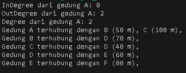
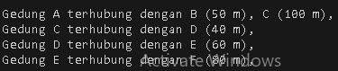

# <p align ="center">  LAPORAN PRAKTIKUM ALGORITMA DAN STRUKTUR DATA </p>
# <p align ="center">  PRAKTIKUM 13 </p>
<br><br><br><br>

<p align="center">
    </p>

<br><br><br><br><br>

<p align = "center"> Nama       : ESA PRATAMA PUTRI </p>
<p align = "center"> NIM        : 2341720061 </p>
<p align = "center"> Kelas / no : TI-1B / 10 </p>
<p align = "center"> Jurusan    : TEKNOLOGI INFORMASI </p>

## 2.1 Percobaan 1: Implementasi Graph menggunakan Linked List
```
public class Node10 {

    public Node10 left = null;
    int data;
    Node10 prev, next;
    int jarak;
    public Node10 right;

    Node10(Node10 prev, int data, int jarak, Node10 next) {
        this.prev = prev;
        this.data = data;
        this.next = next;
        this.jarak = jarak;
    }

    public Node10(Node10 prev2, int input, Object object) {

    }
}
```

```
public class DoubleLinkedList10 {
    Node10 head;
    Node10 tail;
    int size;

    public DoubleLinkedList10() {
        head = null;
        tail = null;
        size = 0;
    }

    public boolean isEmpty() {
        return head == null;
    }

    public void addFirst(int item, int jarak) {
        if (isEmpty()) {
            head = new Node10(null, item, jarak, null);
        } else {
            Node10 newNode10 = new Node10(null, item, jarak, head);
            head.prev = newNode10;
            head = newNode10;
        }
        size++;
    }

    public void addLast(int item, int jarak) {
        if (isEmpty()) {
            addFirst(item, jarak);
        } else {
            Node10 current = head;
            while (current.next != null) {
                current = current.next;
            }
            Node10 newNode = new Node10(current, item, null);
            current.next = newNode;
            size++;
        }
    }

    public void add(int item, int index, int jarak) throws Exception {
        if (isEmpty()) {
            addFirst(item, jarak);
        } else if (index < 0 || index > size) {
            throw new Exception("Nilai indeks di luar batas");
        } else {
            Node10 current = head;
            for (int i = 0; i < index; i++) {
                current = current.next;
            }
            Node10 newNode = new Node10(current.prev, item, current);
            if (current.prev == null) {
                head = newNode;
            } else {
                current.prev.next = newNode;
            }
            current.prev = newNode;
            size++;
        }
    }

    public int size() {
        return size;
    }

    public void clear() {
        head = null;
        size = 0;
    }

    public void print() {
        if (!isEmpty()) {
            Node10 tmp = head;
            while (tmp != null) {
                System.out.print(tmp.data + "\t");
                tmp = tmp.next;
            }
            System.out.println("\nberhasil diisi");
        } else {
            System.out.println("Linked List Kosong");
        }
    }

    public void removeFirst() throws Exception {
        if (isEmpty()) {
            throw new Exception("Linked List masih kosong, tidak dapat dihapus!");
        } else if (size == 1) {
            removeLast();
        } else {
            head = head.next;
            head.prev = null;
            size--;
        }
    }

    public void removeLast() throws Exception {
        if (isEmpty()) {
            throw new Exception("Linked List masih kosong, tidak dapat dihapus!");
        } else if (head.next == null) {
            head = tail = null;
            size--;
        } else {
            tail = tail.prev;
            tail.next = null;
            size--;
        }
    }

    public void remove(int index) {
        Node10 current = head;
        while (current != null) {
            if (current.data == index) {
                if (current.prev != null) {
                } else {
                    head = current.next;
                }
                if (current.next != null) {
                    current.next.prev = current.prev;
                }
                break;
            }
            current = current.next;
        }
        size--;
    }

    public int getFirst() throws Exception {
        if (isEmpty()) {
            throw new Exception("linked List kosong");
        }
        return head.data;
    }

    public int getLast() throws Exception {
        if (isEmpty()) {
            throw new Exception("Linked List kosng");
        }
        Node10 tmp = head;
        while (tmp.next != null) {
            tmp = tmp.next;
        }
        return tmp.data;
    }

    public int get(int index) throws Exception {
        if (isEmpty() || index >= size) {
            throw new Exception("Nilai indeks di luar batas.");
        }
        Node10 current = head;
        for (int i = 0; i < index; i++) {
            current = current.next;
        }
        return current.data;
    }

    public int getJarak(int index) throws Exception {
        if (isEmpty() || index >= size) {
            throw new Exception("Nilai indeks di luar batas");
        }
        Node10 tmp = head;
        for (int i = 0; i < index; i++) {
            tmp = tmp.next;
        }
        return tmp.jarak;
    }

}
```

```
class Graph10 {
    int vertex;
    DoubleLinkedList10 list[];

    public Graph10(int v) {
        vertex = v;
        list = new DoubleLinkedList10[v];
        for (int i = 0; i < v; i++) {
            list[i] = new DoubleLinkedList10();
        }
    }

    public void addEdge(int asal, int tujuan, int jarak) {
        list[asal].addFirst(tujuan, jarak);
    }

    public void degree(int asal) throws Exception {
        int totalIn = 0, totalOut = 0;
        for (int i = 0; i < vertex; i++) {
            // inDegree
            for (int j = 0; j < list[i].size(); j++) {
                if (list[i].get(j) == asal) {
                    totalIn++;
                }
            }
            // outDegree
            if (i == asal) {
                totalOut = list[asal].size();
            }
        }
        System.out.println("InDegree dari gedung " + (char) ('A' + asal) + ": " + totalIn);
        System.out.println("OutDegree dari gedung " + (char) ('A' + asal) + ": " + totalOut);
        System.out.println("Degree dari gedung " + (char) ('A' + asal) + ": " + (totalIn + totalOut));
    }

    public void removeEdge(int asal, int tujuan) throws Exception {
        list[asal].remove(tujuan);
    }

    public void removeAllEdges() {
        for (int i = 0; i < vertex; i++) {
            list[i].clear();
        }
        System.out.println("Graf berhasil dikosongkan");
    }

    public void printGraph() throws Exception {
        for (int i = 0; i < vertex; i++) {
            if (list[i].size() > 0) {
                System.out.print("Gedung " + (char) ('A' + i) + " terhubung dengan ");
                for (int j = 0; j < list[i].size(); j++) {
                    System.out.print((char) ('A' + list[i].get(j)) + " (" + list[i].getJarak(j) + " m), ");
                }
                System.out.println();
            }
        }
        System.out.println("");
    }
}
```

```
public class GraphMain10 {
    public static void main(String[] args) throws Exception {
        Graph10 gedung = new Graph10(6);
        gedung.addEdge(0, 2, 100);
        gedung.addEdge(0, 1, 50);
        gedung.addEdge(1, 3, 70);
        gedung.addEdge(2, 3, 40);
        gedung.addEdge(3, 4, 60);
        gedung.addEdge(4, 5, 80);

        gedung.degree(0);
        gedung.printGraph();
    }
}
```

```
public class GraphMain10 {
    public static void main(String[] args) throws Exception {
        Graph10 gedung = new Graph10(6);
        gedung.addEdge(0, 2, 100);
        gedung.addEdge(0, 1, 50);
        gedung.addEdge(1, 3, 70);
        gedung.addEdge(2, 3, 40);
        gedung.addEdge(3, 4, 60);
        gedung.addEdge(4, 5, 80);

        gedung.degree(0);
        gedung.printGraph();

        gedung.removeEdge(1, 3);
        gedung.printGraph();
    }
}
```
## 2.1.2 Verifikasi Hasil Percobaan
- Hasil running pada langkah 14 <br>
 <br>
- Hasil running pada langkah 17
 <br>
## 2.1.3 Pertanyaan
1. Perbaiki kode program Anda apabila terdapat error atau hasil kompilasi kode tidak sesuai! <br>
- sudah <br>
2. Pada class Graph, terdapat atribut list[] bertipe DoubleLinkedList. Sebutkan tujuan pembuatanvariabel tersebut! <br>
- array yang digunakan untuk menyimpan adjacency list dari graf. Setiap elemen dalam array ini merupakan sebuah linked list yang berisi semua node yang terhubung ke node tertentu.
Tujuan dari pembuatan variabel ini adalah untuk memodelkan struktur data graf menggunakan adjacency list, yang merupakan salah satu metode yang efisien untuk menyimpan graf terutama ketika graf tersebut adalah graf jarang (sparse graph) <br>
3. Jelaskan alur kerja dari method removeEdge! <br>
- Method ini menerima dua parameter, asal (source) dan tujuan (destination), yang menunjukkan edge mana yang akan dihapus <br>
- Method ini memanggil method remove pada adjacency list dari node asal, yang bertujuan untuk menghapus node tujuan dari daftar tetangga node asal <br>
- Jika graf adalah undirected (tidak berarah), biasanya method ini juga akan menghapus node asal dari daftar tetangga node tujuan, tetapi dalam implementasi yang diberikan hanya menghapus satu arah edge <br>
4. Apakah alasan pemanggilan method addFirst() untuk menambahkan data, bukan method add jenis lain saat digunakan pada method addEdge pada class Graph? <br>
5. Modifikasi kode program sehingga dapat dilakukan pengecekan apakah terdapat jalur antara suatu node dengan node lainnya, seperti contoh berikut (Anda dapat memanfaatkan Scanner). <br>
 <br>

## 2.2 Percobaan 2: Implementasi Graph menggunakan Matriks
## 2.2.2 Verifikasi Hasil Percobaan
## 2.2.3 Pertanyaan
1. Perbaiki kode program Anda apabila terdapat error atau hasil kompilasi kode tidak sesuai! <br>
2. Apa jenis graph yang digunakan pada Percobaan 2?<br>
3. Apa maksud dari dua baris kode berikut? <br>
```
gdg.makeEdge(1, 2, 70);
gdg.makeEdge(2, 1, 80);
```
4. Modifikasi kode program sehingga terdapat method untuk menghitung degree, termasuk inDegree dan outDegree! <br>

## Latihan Praktikum
1. Modifikasi kode program pada class GraphMain sehingga terdapat menu program yang bersifat dinamis, setidaknya terdiri dari: <br>
    a) Add Edge <br>
    b) Remove Edge <br>
    c) Degree <br>
    d) Print Graph <br>
    e) Cek Edge <br>
Pengguna dapat memilih menu program melalui input Scanner <br>
2. Tambahkan method updateJarak pada Percobaan 1 yang digunakan untuk mengubah jarak antara dua node asal dan tujuan! <br>
3. Tambahkan method hitungEdge untuk menghitung banyaknya edge yang terdapat di dalam graf! <br>