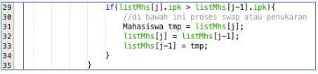
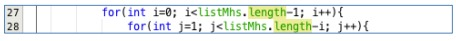
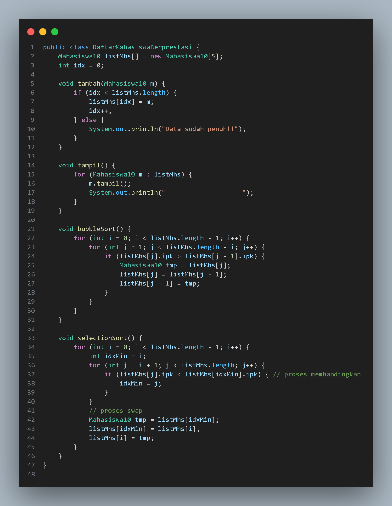
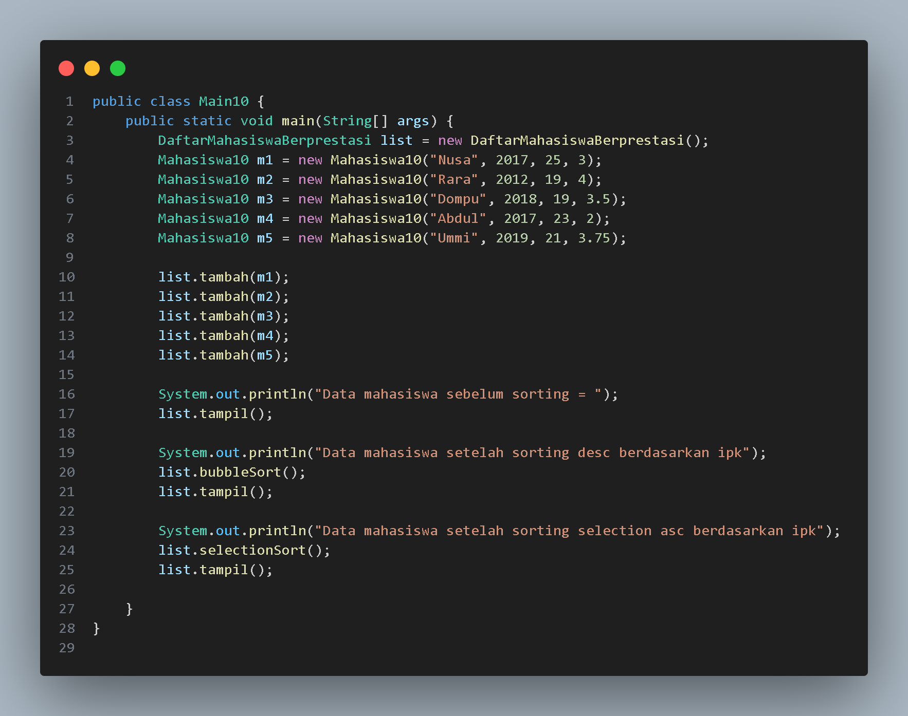
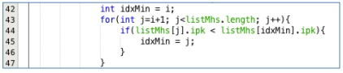
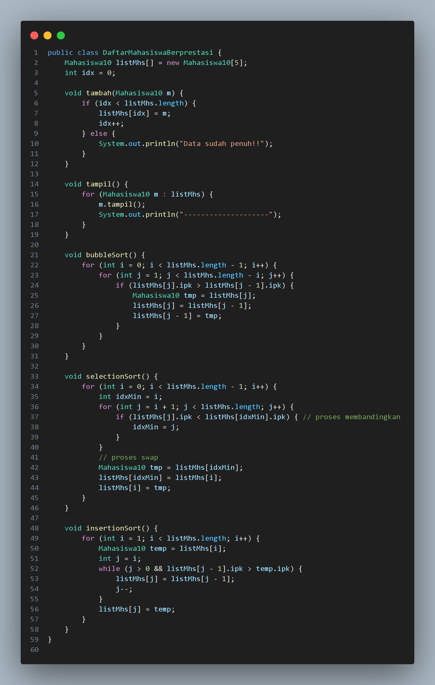
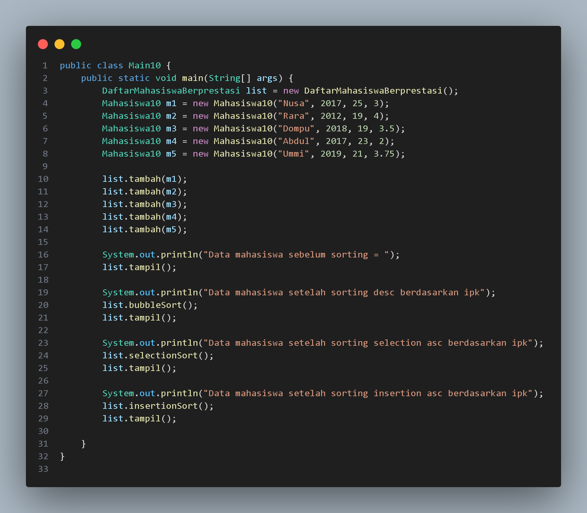
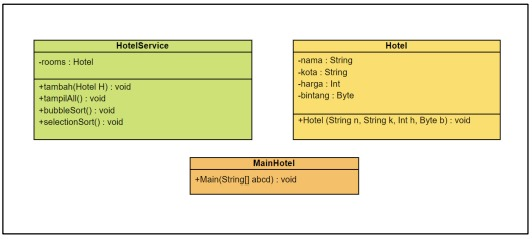

# 
  LAPORAN PRAKTIKUM ALGORITMA DAN STRUKTUR DATA 

# 
 JOBSHEET 5 SORTING (BUBBLE, SELECTION, DAN INSERTION SORT) 

    

    

     

 Nama       : ESA PRATAMA PUTRI 

 NIM        : 2341720061 

 Kelas / no : TI-1B / 10 

 Jurusan    : TEKNOLOGI INFORMASI 

## 5.2 Mengurutkan Data Mahasiswa Berdasarkan IPK Menggunakan Bubble Sort
  
  
  
## 5.2.3 Pertanyaan
1. Terdapat di method apakah proses bubble sort?  
  
2. Di dalam method bubbleSort(), terdapat baris program seperti di bawah ini:  
  
Untuk apakah proses tersebut?  
- bertujuan untuk membandingkan nilai IPK (indeks prestasi kumulatif) dari dua elemen berturut-turut dalam array listMhs yang berisi objek Mahasiswa  
3. Perhatikan perulangan di dalam bubbleSort() di bawah ini:  
  
a. Apakah perbedaan antara kegunaan perulangan i dan perulangan j?  
- Perulangan i digunakan sebagai pengontrol untuk iterasi melalui seluruh array listMhs, sedangkan perulangan j digunakan sebagai pengontrol untuk iterasi dalam setiap langkah pembubble-an (proses pertukaran elemen-elemen)  
b. Mengapa syarat dari perulangan i adalah i<listMhs.length-1 ? 
 
- karena setiap iterasi i mewakili satu langkah pembubble-an  
c. Mengapa syarat dari perulangan j adalah j<listMhs.length-i ? 
 
- karena setiap iterasi j memperkecil jangkauan elemen yang perlu dipertimbangkan  
d. Jika banyak data di dalam listMhs adalah 50, maka berapakali perulangan i akan
berlangsung? Dan ada berapa Tahap bubble sort yang ditempuh?  
akan berlangsung sebanyak 49 kali (karena listMhs.length - 1 = 50 - 1 = 49)  

## 5.3 Mengurutkan Data Mahasiswa Berdasarkan IPK Menggunakan Selection Sort
  
  
## 5.3.3. Pertanyaan
Di dalam method selection sort, terdapat baris program seperti di bawah ini:  
  
Untuk apakah proses tersebut, jelaskan!  
- langkah pencarian elemen dengan nilai IPK terkecil dalam algoritma selection sort. Pada setiap iterasi, algoritma mencari elemen dengan nilai IPK terendah dari elemen-elemen yang belum diurutkan, dan menandai indeksnya untuk kemudian dipindahkan ke posisi yang sesuai dalam proses pertukaran  

## 5.4 Mengurutkan Data Mahasiswa Berdasarkan IPK Menggunakan Insertion Sort
  
  
## 5.4.3 Pertanyaan
Ubahlah fungsi pada InsertionSort sehingga fungsi ini dapat melaksanakan proses sorting dengan cara descending  
  

## 5.5 Latihan Praktikum
Sebuah platform travel yang menyediakan layanan pemesanan kebutuhan travelling sedang mengembangkan backend untuk sistem pemesanan/reservasi akomodasi (penginapan), salah satu fiturnya adalah menampilkan daftar penginapan yang tersedia berdasarkan pilihan filter yang diinginkan user. Daftar penginapan ini harus dapat disorting berdasarkan  
1. Harga dimulai dari harga termurah ke harga tertinggi.  
2. Rating bintang penginapan dari bintang tertinggi (5) ke terendah (1)  
Buatlah proses sorting data untuk kedua filter tersebut dengan menggunakan algoritma bubble sort dan selection sort.  
  

  
  
  