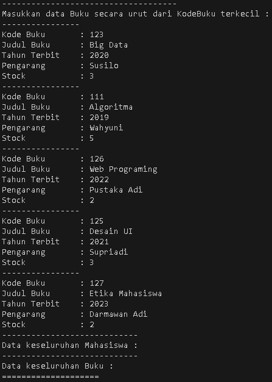
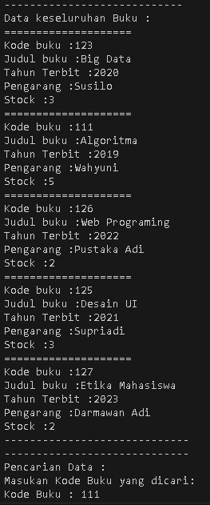
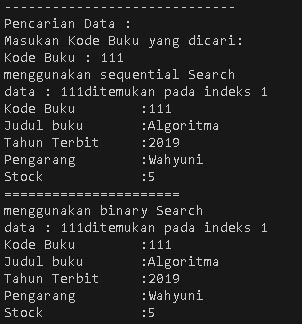
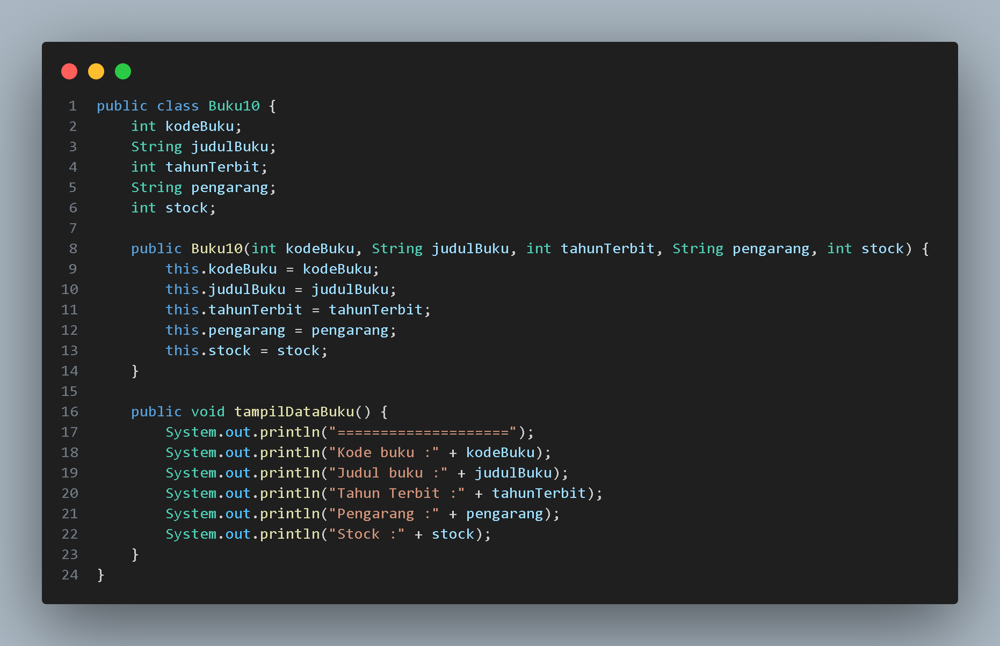
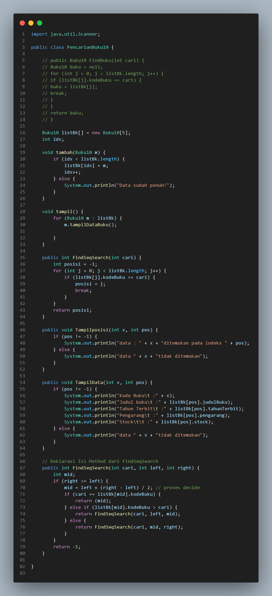
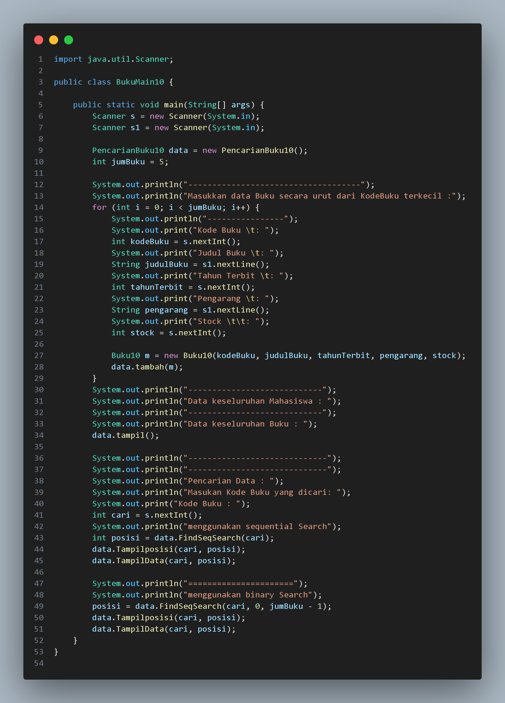

# 
  LAPORAN PRAKTIKUM ALGORITMA DAN STRUKTUR DATA 

# 
 JOBSHEET 6 SEARCHING 

    

    

     

 Nama       : ESA PRATAMA PUTRI 

 NIM        : 2341720061 

 Kelas / no : TI-1B / 10 

 Jurusan    : TEKNOLOGI INFORMASI 

## 6.2 Searching / Pencarian Menggunakan Agoritma Sequential Search
  
  
  
## 6.2.3 Pertanyaan
1. Jelaskan fungsi break yang ada pada method FindSeqSearch!  
- digunakan untuk menghentikan iterasi loop for saat elemen yang dicari ditemukan  
2. Jika Data Kode Buku yang dimasukkan tidak terurut dari kecil ke besar. Apakah program masih dapat berjalan? Apakah hasil yang dikeluarkan benar? Tunjukkan hasil screenshoot untuk bukti dengan kode Buku yang acak. Jelaskan Mengapa hal tersebut bisa terjadi?  
- Program yang diberikan akan tetap berjalan meskipun data kode buku yang dimasukkan tidak terurut dari kecil ke besar. 
  
  
  
3. Buat method baru dengan nama FindBuku menggunakan konsep sequential search dengan tipe method dari FindBuku adalah BukuNoAbsen. Sehingga Anda bisa memanggil method tersebut pada class BukuMain seperti gambar berikut :  
Buku dataBuku = data.FindBuku(cari);  
dataBuku.tampilDataBuku();  
  

## 6.3 Searching / Pencarian Menggunakan Binary Search
  
  
## 6.3.3 Pertanyaan
1. Tunjukkan pada kode program yang mana proses divide dijalankan!  
  
2. Tunjukkan pada kode program yang mana proses conquer dijalankan!  
  
3. Jika data Kode Buku yang dimasukkan tidak urut. Apakah program masih dapat berjalan? Mengapa
demikian! Tunjukkan hasil screenshoot untuk bukti dengan kode Buku yang acak. Jelaskan Mengapa hal tersebut bisa terjadi?  
- Program masih akan berjalan meskipun data Kode Buku yang dimasukkan tidak urut. karena pencarian dilakukan baik dengan pencarian berurutan (sequential search) maupun pencarian biner (binary search)  

4. Jika Kode Buku yang dimasukkan dari Kode Buku terbesar ke terkecil (missal : 20215, 20214, 20212, 20211, 20210) dan elemen yang dicari adalah 20210. Bagaimana hasil dari binary search? Apakah sesuai? Jika tidak sesuai maka ubahlah kode program binary seach agar hasilnya sesuai!  
  

## 6.4 Percobaan Pengayaan Divide and Conquer
  
  

## 6.5. Latihan Praktikum
1. Modifikasi percobaan searching diatas dengan ketentuan berikut ini  
- Ubah tipe data dari kode Buku yang awalnya int menjadi String  
- Tambahkan method untuk pencarian kode Buku (bertipe data String) dengan menggunakan sequential search dan binary search.  
  
  
  

2. Modifikasi percobaan searching diatas dengan ketentuan berikut ini  
- Tambahkan method pencarian judul buku menggunakan sequential search dan binary 
search. Sebelum dilakukan searching dengan binary search data harus dilakukan pengurutan dengan menggunakan algoritma Sorting (bebas pilih algoritma sorting apapun)! Sehingga ketika input data acak, maka algoritma searching akan tetap berjalan  
- Buat aturan untuk mendeteksi hasil pencarian judul buku yang lebih dari 1 hasil dalam bentuk kalimat peringatan! Pastikan algoritma yang diterapkan sesuai dengan kasus yang diberikan !  